# Netty组件

## EventLoop

**事件循环对象**

EventLoop 本质是一个单线程执行器（同时维护了一个 Selector），里面有 run 方法处理 Channel 上源源不断的 io 事件。

它的继承关系比较复杂

* 一条线是继承自 j.u.c.ScheduledExecutorService 因此包含了线程池中所有的方法
* 另一条线是继承自 netty 自己的 OrderedEventExecutor，
  * 提供了 boolean inEventLoop(Thread thread) 方法判断一个线程是否属于此 EventLoop
  * 提供了 parent 方法来看看自己属于哪个 EventLoopGroup


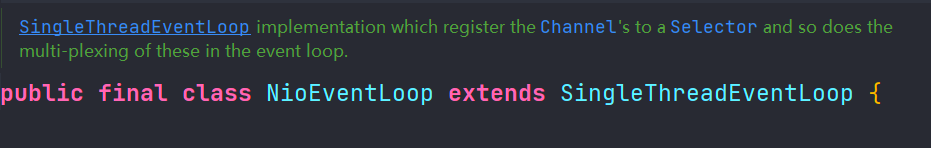


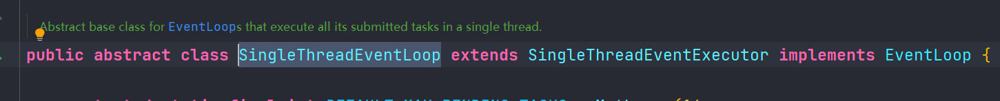


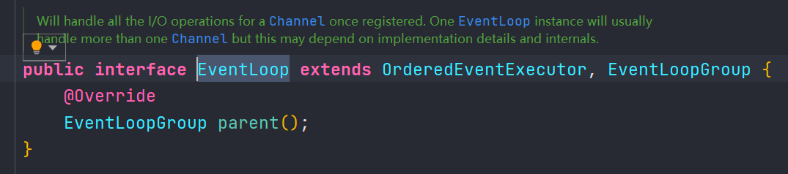


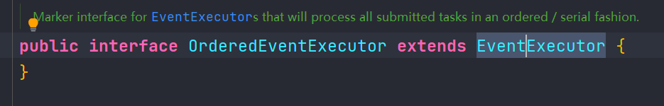


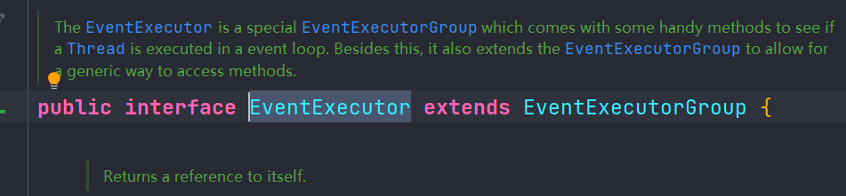


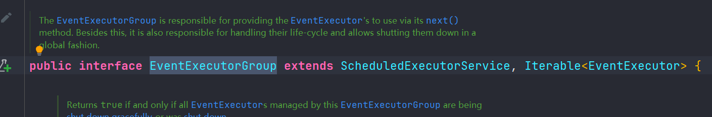


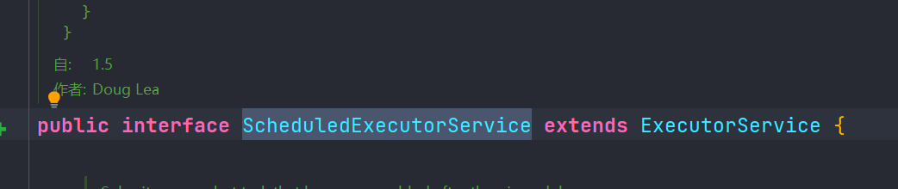


**事件循环组**

EventLoopGroup 是一组 EventLoop，Channel 一般会调用 EventLoopGroup 的 register 方法来绑定其中一个 EventLoop，后续这个 Channel 上的 io 事件都由此 EventLoop 来处理（保证了 io 事件处理时的线程安全）

* 继承自 netty 自己的 EventExecutorGroup
  * 实现了 Iterable 接口提供遍历 EventLoop 的能力
  * 另有 next 方法获取集合中下一个 EventLoop


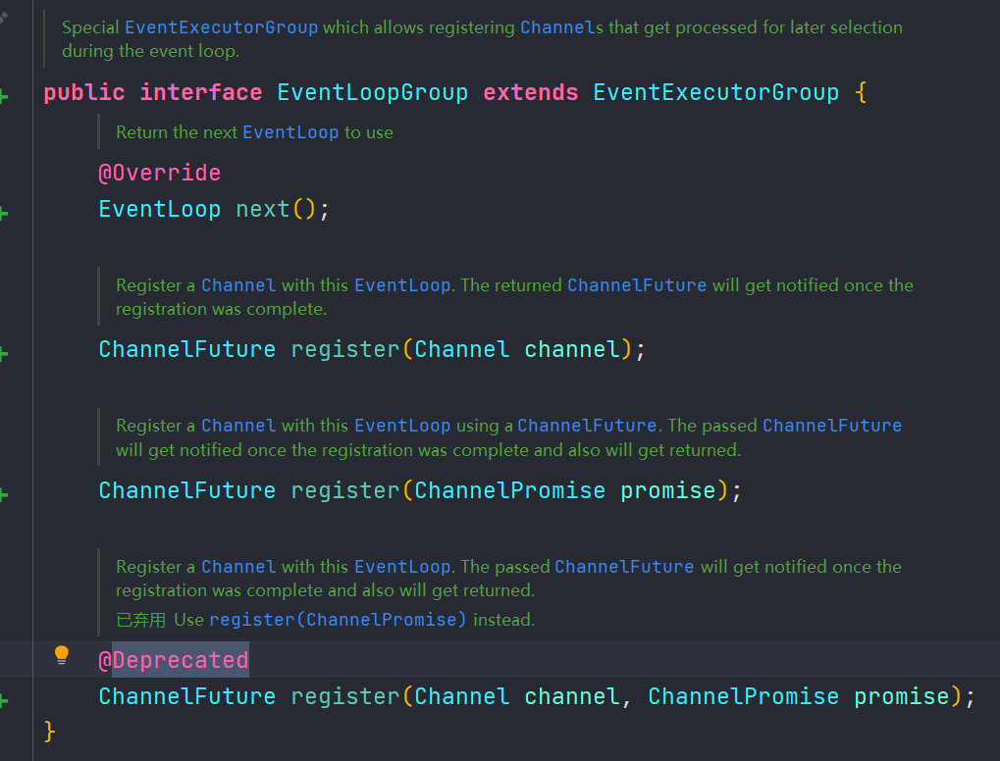


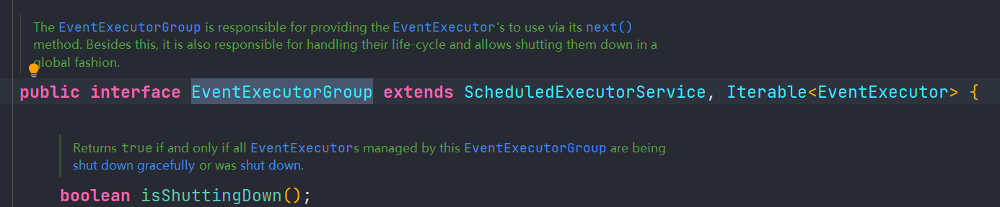


使用示例：

```java
package mao.t1;

import io.netty.channel.DefaultEventLoopGroup;
import lombok.SneakyThrows;
import lombok.extern.slf4j.Slf4j;

/**
 * Project name(项目名称)：Netty_Component
 * Package(包名): mao.t1
 * Class(类名): EventLoopGroupTest
 * Author(作者）: mao
 * Author QQ：1296193245
 * GitHub：https://github.com/maomao124/
 * Date(创建日期)： 2023/3/17
 * Time(创建时间)： 23:59
 * Version(版本): 1.0
 * Description(描述)： EventLoopGroup测试
 */

@Slf4j
public class EventLoopGroupTest
{
    @SneakyThrows
    public static void main(String[] args)
    {
        //内部创建了三个EventLoop,每个EventLoop维护一个线程
        DefaultEventLoopGroup defaultEventLoopGroup = new DefaultEventLoopGroup(3);
        log.debug(defaultEventLoopGroup.next().toString());
        log.debug(defaultEventLoopGroup.next().toString());
        log.debug(defaultEventLoopGroup.next().toString());
        //第4个和第一个地址一样
        log.debug(defaultEventLoopGroup.next().toString());
        defaultEventLoopGroup.submit(() -> log.debug("1"));
        Thread.sleep(100);
        defaultEventLoopGroup.submit(() -> log.debug("2"));
        Thread.sleep(100);
        defaultEventLoopGroup.submit(() -> log.debug("3"));
        Thread.sleep(100);
        //循环
        defaultEventLoopGroup.submit(() -> log.debug("4"));
        Thread.sleep(100);
        defaultEventLoopGroup.submit(() -> log.debug("5"));
        Thread.sleep(100);
        //和直接调用submit方法一样
        defaultEventLoopGroup.next().submit(() -> log.debug("6"));
    }
}
```


运行结果：

```sh
2023-03-18  00:05:25.636  [main] DEBUG io.netty.util.internal.logging.InternalLoggerFactory:  Using SLF4J as the default logging framework
2023-03-18  00:05:25.639  [main] DEBUG io.netty.channel.MultithreadEventLoopGroup:  -Dio.netty.eventLoopThreads: 64
2023-03-18  00:05:25.644  [main] DEBUG io.netty.util.internal.InternalThreadLocalMap:  -Dio.netty.threadLocalMap.stringBuilder.initialSize: 1024
2023-03-18  00:05:25.644  [main] DEBUG io.netty.util.internal.InternalThreadLocalMap:  -Dio.netty.threadLocalMap.stringBuilder.maxSize: 4096
2023-03-18  00:05:25.647  [main] DEBUG mao.t1.EventLoopGroupTest:  io.netty.channel.DefaultEventLoop@1ca3b418
2023-03-18  00:05:25.647  [main] DEBUG mao.t1.EventLoopGroupTest:  io.netty.channel.DefaultEventLoop@58cbafc2
2023-03-18  00:05:25.648  [main] DEBUG mao.t1.EventLoopGroupTest:  io.netty.channel.DefaultEventLoop@2034b64c
2023-03-18  00:05:25.648  [main] DEBUG mao.t1.EventLoopGroupTest:  io.netty.channel.DefaultEventLoop@1ca3b418
2023-03-18  00:05:25.649  [defaultEventLoopGroup-2-1] DEBUG mao.t1.EventLoopGroupTest:  1
2023-03-18  00:05:25.756  [defaultEventLoopGroup-2-2] DEBUG mao.t1.EventLoopGroupTest:  2
2023-03-18  00:05:25.867  [defaultEventLoopGroup-2-3] DEBUG mao.t1.EventLoopGroupTest:  3
2023-03-18  00:05:25.979  [defaultEventLoopGroup-2-1] DEBUG mao.t1.EventLoopGroupTest:  4
2023-03-18  00:05:26.088  [defaultEventLoopGroup-2-2] DEBUG mao.t1.EventLoopGroupTest:  5
2023-03-18  00:05:26.197  [defaultEventLoopGroup-2-3] DEBUG mao.t1.EventLoopGroupTest:  6
```


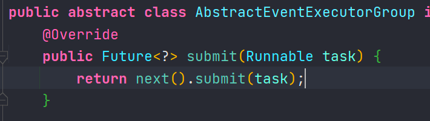


也可以使用 for 循环:

```java
package mao.t1;

import io.netty.channel.DefaultEventLoopGroup;
import io.netty.util.concurrent.EventExecutor;
import lombok.extern.slf4j.Slf4j;

/**
 * Project name(项目名称)：Netty_Component
 * Package(包名): mao.t1
 * Class(类名): EventLoopGroupTest2
 * Author(作者）: mao
 * Author QQ：1296193245
 * GitHub：https://github.com/maomao124/
 * Date(创建日期)： 2023/3/18
 * Time(创建时间)： 0:08
 * Version(版本): 1.0
 * Description(描述)： EventLoopGroup测试
 */

@Slf4j
public class EventLoopGroupTest2
{
    public static void main(String[] args)
    {
        //内部创建了三个EventLoop,每个EventLoop维护一个线程
        DefaultEventLoopGroup defaultEventLoopGroup = new DefaultEventLoopGroup(3);
        for (EventExecutor eventExecutor : defaultEventLoopGroup)
        {
            log.debug(eventExecutor.toString());
        }
        //再次调用
        for (EventExecutor eventExecutor : defaultEventLoopGroup)
        {
            log.debug(eventExecutor.toString());
        }
    }
}
```


运行结果：

```sh
2023-03-18  00:09:15.981  [main] DEBUG mao.t1.EventLoopGroupTest2:  io.netty.channel.DefaultEventLoop@1ca3b418
2023-03-18  00:09:15.981  [main] DEBUG mao.t1.EventLoopGroupTest2:  io.netty.channel.DefaultEventLoop@58cbafc2
2023-03-18  00:09:15.981  [main] DEBUG mao.t1.EventLoopGroupTest2:  io.netty.channel.DefaultEventLoop@2034b64c
2023-03-18  00:09:15.981  [main] DEBUG mao.t1.EventLoopGroupTest2:  io.netty.channel.DefaultEventLoop@1ca3b418
2023-03-18  00:09:15.981  [main] DEBUG mao.t1.EventLoopGroupTest2:  io.netty.channel.DefaultEventLoop@58cbafc2
2023-03-18  00:09:15.981  [main] DEBUG mao.t1.EventLoopGroupTest2:  io.netty.channel.DefaultEventLoop@2034b64c
```


**关闭：**

`shutdownGracefully` 方法。该方法会首先切换 `EventLoopGroup` 到关闭状态从而拒绝新的任务的加入，然后在任务队列的任务都处理完成后，停止线程的运行。从而确保整体应用是在正常有序的状态下退出的

```java
defaultEventLoopGroup.shutdownGracefully();
```


### NioEventLoop处理io事件

服务端

```java
package mao.t2;

import io.netty.bootstrap.ServerBootstrap;
import io.netty.channel.ChannelHandlerContext;
import io.netty.channel.ChannelInitializer;
import io.netty.channel.SimpleChannelInboundHandler;
import io.netty.channel.nio.NioEventLoopGroup;
import io.netty.channel.socket.nio.NioServerSocketChannel;
import io.netty.channel.socket.nio.NioSocketChannel;
import io.netty.handler.codec.string.StringDecoder;
import lombok.SneakyThrows;
import lombok.extern.slf4j.Slf4j;

/**
 * Project name(项目名称)：Netty_Component
 * Package(包名): mao.t2
 * Class(类名): Server
 * Author(作者）: mao
 * Author QQ：1296193245
 * GitHub：https://github.com/maomao124/
 * Date(创建日期)： 2023/3/18
 * Time(创建时间)： 13:57
 * Version(版本): 1.0
 * Description(描述)： NioEventLoop处理io事件
 */

@Slf4j
public class Server
{
    @SneakyThrows
    public static void main(String[] args)
    {
        new ServerBootstrap()
                //第一个参数是处理接收事件的EventLoop，线程数量为1个，第二个参数为处理读写事件的EventLoop，线程数量为3个
                .group(new NioEventLoopGroup(1), new NioEventLoopGroup(3))
                .channel(NioServerSocketChannel.class)
                .childHandler(new ChannelInitializer<NioSocketChannel>()
                {
                    @Override
                    protected void initChannel(NioSocketChannel ch) throws Exception
                    {
                        ch.pipeline().addLast(new StringDecoder())
                                .addLast(new SimpleChannelInboundHandler<String>()
                                {
                                    @Override
                                    protected void channelRead0(ChannelHandlerContext ctx, String msg) throws Exception
                                    {
                                        log.debug(ctx.toString());
                                        log.debug(msg);
                                    }
                                });
                    }
                })
                .bind(8080)
                .sync();

    }
}
```


客户端

```java
package mao.t2;

import io.netty.bootstrap.Bootstrap;
import io.netty.channel.Channel;
import io.netty.channel.ChannelInitializer;
import io.netty.channel.nio.NioEventLoopGroup;
import io.netty.channel.socket.nio.NioSocketChannel;
import io.netty.handler.codec.string.StringEncoder;
import io.netty.handler.logging.LogLevel;
import io.netty.handler.logging.LoggingHandler;
import lombok.SneakyThrows;
import lombok.extern.slf4j.Slf4j;

import java.net.InetSocketAddress;

/**
 * Project name(项目名称)：Netty_Component
 * Package(包名): mao.t2
 * Class(类名): Client
 * Author(作者）: mao
 * Author QQ：1296193245
 * GitHub：https://github.com/maomao124/
 * Date(创建日期)： 2023/3/18
 * Time(创建时间)： 14:07
 * Version(版本): 1.0
 * Description(描述)： NioEventLoop处理io事件
 */

@Slf4j
public class Client
{
    @SneakyThrows
    public static void main(String[] args)
    {

        for (int i = 0; i < 5; i++)
        {
            Channel channel = new Bootstrap()
                    .group(new NioEventLoopGroup(1))
                    .channel(NioSocketChannel.class)
                    .handler(new ChannelInitializer<NioSocketChannel>()
                    {
                        @Override
                        protected void initChannel(NioSocketChannel ch) throws Exception
                        {
                            ch.pipeline().addLast(new StringEncoder())
                                    .addLast(new LoggingHandler(LogLevel.DEBUG));
                        }
                    })
                    .connect(new InetSocketAddress(8080)).sync().channel();

            channel.writeAndFlush("客户端" + (i + 1) + " -1");
            Thread.sleep(100);
            channel.writeAndFlush("客户端" + (i + 1) + " -2");
            Thread.sleep(100);
            channel.writeAndFlush("客户端" + (i + 1) + " -3");
            Thread.sleep(100);
            channel.writeAndFlush("客户端" + (i + 1) + " -4");
            Thread.sleep(100);
            channel.writeAndFlush("客户端" + (i + 1) + " -5");
            Thread.sleep(100);
            channel.close();
        }

    }
}
```


服务端运行结果：

```sh
2023-03-18  14:18:43.716  [nioEventLoopGroup-3-1] DEBUG mao.t2.Server:  ChannelHandlerContext(Server$1$1#0, [id: 0x69e92d02, L:/127.0.0.1:8080 - R:/127.0.0.1:64288])
2023-03-18  14:18:43.716  [nioEventLoopGroup-3-1] DEBUG mao.t2.Server:  客户端1 -1
2023-03-18  14:18:43.815  [nioEventLoopGroup-3-1] DEBUG mao.t2.Server:  ChannelHandlerContext(Server$1$1#0, [id: 0x69e92d02, L:/127.0.0.1:8080 - R:/127.0.0.1:64288])
2023-03-18  14:18:43.815  [nioEventLoopGroup-3-1] DEBUG mao.t2.Server:  客户端1 -2
2023-03-18  14:18:43.928  [nioEventLoopGroup-3-1] DEBUG mao.t2.Server:  ChannelHandlerContext(Server$1$1#0, [id: 0x69e92d02, L:/127.0.0.1:8080 - R:/127.0.0.1:64288])
2023-03-18  14:18:43.928  [nioEventLoopGroup-3-1] DEBUG mao.t2.Server:  客户端1 -3
2023-03-18  14:18:44.033  [nioEventLoopGroup-3-1] DEBUG mao.t2.Server:  ChannelHandlerContext(Server$1$1#0, [id: 0x69e92d02, L:/127.0.0.1:8080 - R:/127.0.0.1:64288])
2023-03-18  14:18:44.033  [nioEventLoopGroup-3-1] DEBUG mao.t2.Server:  客户端1 -4
2023-03-18  14:18:44.144  [nioEventLoopGroup-3-1] DEBUG mao.t2.Server:  ChannelHandlerContext(Server$1$1#0, [id: 0x69e92d02, L:/127.0.0.1:8080 - R:/127.0.0.1:64288])
2023-03-18  14:18:44.144  [nioEventLoopGroup-3-1] DEBUG mao.t2.Server:  客户端1 -5
2023-03-18  14:18:44.259  [nioEventLoopGroup-3-2] DEBUG mao.t2.Server:  ChannelHandlerContext(Server$1$1#0, [id: 0xce929642, L:/127.0.0.1:8080 - R:/127.0.0.1:64289])
2023-03-18  14:18:44.259  [nioEventLoopGroup-3-2] DEBUG mao.t2.Server:  客户端2 -1
2023-03-18  14:18:44.361  [nioEventLoopGroup-3-2] DEBUG mao.t2.Server:  ChannelHandlerContext(Server$1$1#0, [id: 0xce929642, L:/127.0.0.1:8080 - R:/127.0.0.1:64289])
2023-03-18  14:18:44.362  [nioEventLoopGroup-3-2] DEBUG mao.t2.Server:  客户端2 -2
2023-03-18  14:18:44.471  [nioEventLoopGroup-3-2] DEBUG mao.t2.Server:  ChannelHandlerContext(Server$1$1#0, [id: 0xce929642, L:/127.0.0.1:8080 - R:/127.0.0.1:64289])
2023-03-18  14:18:44.471  [nioEventLoopGroup-3-2] DEBUG mao.t2.Server:  客户端2 -3
2023-03-18  14:18:44.581  [nioEventLoopGroup-3-2] DEBUG mao.t2.Server:  ChannelHandlerContext(Server$1$1#0, [id: 0xce929642, L:/127.0.0.1:8080 - R:/127.0.0.1:64289])
2023-03-18  14:18:44.581  [nioEventLoopGroup-3-2] DEBUG mao.t2.Server:  客户端2 -4
2023-03-18  14:18:44.690  [nioEventLoopGroup-3-2] DEBUG mao.t2.Server:  ChannelHandlerContext(Server$1$1#0, [id: 0xce929642, L:/127.0.0.1:8080 - R:/127.0.0.1:64289])
2023-03-18  14:18:44.690  [nioEventLoopGroup-3-2] DEBUG mao.t2.Server:  客户端2 -5
2023-03-18  14:18:44.804  [nioEventLoopGroup-3-3] DEBUG mao.t2.Server:  ChannelHandlerContext(Server$1$1#0, [id: 0xc76a17e1, L:/127.0.0.1:8080 - R:/127.0.0.1:64290])
2023-03-18  14:18:44.805  [nioEventLoopGroup-3-3] DEBUG mao.t2.Server:  客户端3 -1
2023-03-18  14:18:44.908  [nioEventLoopGroup-3-3] DEBUG mao.t2.Server:  ChannelHandlerContext(Server$1$1#0, [id: 0xc76a17e1, L:/127.0.0.1:8080 - R:/127.0.0.1:64290])
2023-03-18  14:18:44.908  [nioEventLoopGroup-3-3] DEBUG mao.t2.Server:  客户端3 -2
2023-03-18  14:18:45.015  [nioEventLoopGroup-3-3] DEBUG mao.t2.Server:  ChannelHandlerContext(Server$1$1#0, [id: 0xc76a17e1, L:/127.0.0.1:8080 - R:/127.0.0.1:64290])
2023-03-18  14:18:45.015  [nioEventLoopGroup-3-3] DEBUG mao.t2.Server:  客户端3 -3
2023-03-18  14:18:45.126  [nioEventLoopGroup-3-3] DEBUG mao.t2.Server:  ChannelHandlerContext(Server$1$1#0, [id: 0xc76a17e1, L:/127.0.0.1:8080 - R:/127.0.0.1:64290])
2023-03-18  14:18:45.126  [nioEventLoopGroup-3-3] DEBUG mao.t2.Server:  客户端3 -4
2023-03-18  14:18:45.234  [nioEventLoopGroup-3-3] DEBUG mao.t2.Server:  ChannelHandlerContext(Server$1$1#0, [id: 0xc76a17e1, L:/127.0.0.1:8080 - R:/127.0.0.1:64290])
2023-03-18  14:18:45.234  [nioEventLoopGroup-3-3] DEBUG mao.t2.Server:  客户端3 -5
2023-03-18  14:18:45.352  [nioEventLoopGroup-3-1] DEBUG mao.t2.Server:  ChannelHandlerContext(Server$1$1#0, [id: 0xdc86e43f, L:/127.0.0.1:8080 - R:/127.0.0.1:64291])
2023-03-18  14:18:45.353  [nioEventLoopGroup-3-1] DEBUG mao.t2.Server:  客户端4 -1
2023-03-18  14:18:45.451  [nioEventLoopGroup-3-1] DEBUG mao.t2.Server:  ChannelHandlerContext(Server$1$1#0, [id: 0xdc86e43f, L:/127.0.0.1:8080 - R:/127.0.0.1:64291])
2023-03-18  14:18:45.452  [nioEventLoopGroup-3-1] DEBUG mao.t2.Server:  客户端4 -2
2023-03-18  14:18:45.562  [nioEventLoopGroup-3-1] DEBUG mao.t2.Server:  ChannelHandlerContext(Server$1$1#0, [id: 0xdc86e43f, L:/127.0.0.1:8080 - R:/127.0.0.1:64291])
2023-03-18  14:18:45.562  [nioEventLoopGroup-3-1] DEBUG mao.t2.Server:  客户端4 -3
2023-03-18  14:18:45.670  [nioEventLoopGroup-3-1] DEBUG mao.t2.Server:  ChannelHandlerContext(Server$1$1#0, [id: 0xdc86e43f, L:/127.0.0.1:8080 - R:/127.0.0.1:64291])
2023-03-18  14:18:45.670  [nioEventLoopGroup-3-1] DEBUG mao.t2.Server:  客户端4 -4
2023-03-18  14:18:45.779  [nioEventLoopGroup-3-1] DEBUG mao.t2.Server:  ChannelHandlerContext(Server$1$1#0, [id: 0xdc86e43f, L:/127.0.0.1:8080 - R:/127.0.0.1:64291])
2023-03-18  14:18:45.779  [nioEventLoopGroup-3-1] DEBUG mao.t2.Server:  客户端4 -5
2023-03-18  14:18:45.886  [nioEventLoopGroup-3-2] DEBUG mao.t2.Server:  ChannelHandlerContext(Server$1$1#0, [id: 0x77c2d44c, L:/127.0.0.1:8080 - R:/127.0.0.1:64292])
2023-03-18  14:18:45.886  [nioEventLoopGroup-3-2] DEBUG mao.t2.Server:  客户端5 -1
2023-03-18  14:18:45.997  [nioEventLoopGroup-3-2] DEBUG mao.t2.Server:  ChannelHandlerContext(Server$1$1#0, [id: 0x77c2d44c, L:/127.0.0.1:8080 - R:/127.0.0.1:64292])
2023-03-18  14:18:45.997  [nioEventLoopGroup-3-2] DEBUG mao.t2.Server:  客户端5 -2
2023-03-18  14:18:46.105  [nioEventLoopGroup-3-2] DEBUG mao.t2.Server:  ChannelHandlerContext(Server$1$1#0, [id: 0x77c2d44c, L:/127.0.0.1:8080 - R:/127.0.0.1:64292])
2023-03-18  14:18:46.105  [nioEventLoopGroup-3-2] DEBUG mao.t2.Server:  客户端5 -3
2023-03-18  14:18:46.214  [nioEventLoopGroup-3-2] DEBUG mao.t2.Server:  ChannelHandlerContext(Server$1$1#0, [id: 0x77c2d44c, L:/127.0.0.1:8080 - R:/127.0.0.1:64292])
2023-03-18  14:18:46.214  [nioEventLoopGroup-3-2] DEBUG mao.t2.Server:  客户端5 -4
2023-03-18  14:18:46.323  [nioEventLoopGroup-3-2] DEBUG mao.t2.Server:  ChannelHandlerContext(Server$1$1#0, [id: 0x77c2d44c, L:/127.0.0.1:8080 - R:/127.0.0.1:64292])
2023-03-18  14:18:46.323  [nioEventLoopGroup-3-2] DEBUG mao.t2.Server:  客户端5 -5
```


可以看到三个工人轮流处理 channel，但工人与 channel 之间进行了绑定


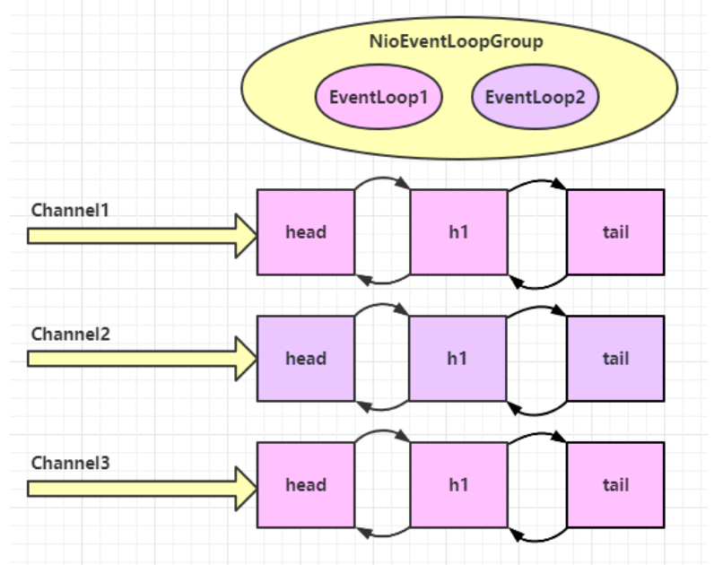


在添加一个个人，由3个个人变成4个个人：

```sh
2023-03-18  14:25:18.883  [nioEventLoopGroup-3-1] DEBUG mao.t2.Server:  ChannelHandlerContext(Server$1$1#0, [id: 0xc25920ba, L:/127.0.0.1:8080 - R:/127.0.0.1:50228])
2023-03-18  14:25:18.883  [nioEventLoopGroup-3-1] DEBUG mao.t2.Server:  客户端1 -1
2023-03-18  14:25:18.965  [nioEventLoopGroup-3-1] DEBUG mao.t2.Server:  ChannelHandlerContext(Server$1$1#0, [id: 0xc25920ba, L:/127.0.0.1:8080 - R:/127.0.0.1:50228])
2023-03-18  14:25:18.965  [nioEventLoopGroup-3-1] DEBUG mao.t2.Server:  客户端1 -2
2023-03-18  14:25:19.088  [nioEventLoopGroup-3-1] DEBUG mao.t2.Server:  ChannelHandlerContext(Server$1$1#0, [id: 0xc25920ba, L:/127.0.0.1:8080 - R:/127.0.0.1:50228])
2023-03-18  14:25:19.088  [nioEventLoopGroup-3-1] DEBUG mao.t2.Server:  客户端1 -3
2023-03-18  14:25:19.199  [nioEventLoopGroup-3-1] DEBUG mao.t2.Server:  ChannelHandlerContext(Server$1$1#0, [id: 0xc25920ba, L:/127.0.0.1:8080 - R:/127.0.0.1:50228])
2023-03-18  14:25:19.199  [nioEventLoopGroup-3-1] DEBUG mao.t2.Server:  客户端1 -4
2023-03-18  14:25:19.310  [nioEventLoopGroup-3-1] DEBUG mao.t2.Server:  ChannelHandlerContext(Server$1$1#0, [id: 0xc25920ba, L:/127.0.0.1:8080 - R:/127.0.0.1:50228])
2023-03-18  14:25:19.311  [nioEventLoopGroup-3-1] DEBUG mao.t2.Server:  客户端1 -5
2023-03-18  14:25:19.426  [nioEventLoopGroup-3-2] DEBUG mao.t2.Server:  ChannelHandlerContext(Server$1$1#0, [id: 0x10b46bbc, L:/127.0.0.1:8080 - R:/127.0.0.1:50229])
2023-03-18  14:25:19.427  [nioEventLoopGroup-3-2] DEBUG mao.t2.Server:  客户端2 -1
2023-03-18  14:25:19.528  [nioEventLoopGroup-3-2] DEBUG mao.t2.Server:  ChannelHandlerContext(Server$1$1#0, [id: 0x10b46bbc, L:/127.0.0.1:8080 - R:/127.0.0.1:50229])
2023-03-18  14:25:19.529  [nioEventLoopGroup-3-2] DEBUG mao.t2.Server:  客户端2 -2
2023-03-18  14:25:19.637  [nioEventLoopGroup-3-2] DEBUG mao.t2.Server:  ChannelHandlerContext(Server$1$1#0, [id: 0x10b46bbc, L:/127.0.0.1:8080 - R:/127.0.0.1:50229])
2023-03-18  14:25:19.638  [nioEventLoopGroup-3-2] DEBUG mao.t2.Server:  客户端2 -3
2023-03-18  14:25:19.746  [nioEventLoopGroup-3-2] DEBUG mao.t2.Server:  ChannelHandlerContext(Server$1$1#0, [id: 0x10b46bbc, L:/127.0.0.1:8080 - R:/127.0.0.1:50229])
2023-03-18  14:25:19.746  [nioEventLoopGroup-3-2] DEBUG mao.t2.Server:  客户端2 -4
2023-03-18  14:25:19.854  [nioEventLoopGroup-3-2] DEBUG mao.t2.Server:  ChannelHandlerContext(Server$1$1#0, [id: 0x10b46bbc, L:/127.0.0.1:8080 - R:/127.0.0.1:50229])
2023-03-18  14:25:19.854  [nioEventLoopGroup-3-2] DEBUG mao.t2.Server:  客户端2 -5
2023-03-18  14:25:19.974  [nioEventLoopGroup-3-3] DEBUG mao.t2.Server:  ChannelHandlerContext(Server$1$1#0, [id: 0x6bcf6c90, L:/127.0.0.1:8080 - R:/127.0.0.1:50231])
2023-03-18  14:25:19.974  [nioEventLoopGroup-3-3] DEBUG mao.t2.Server:  客户端3 -1
2023-03-18  14:25:20.071  [nioEventLoopGroup-3-3] DEBUG mao.t2.Server:  ChannelHandlerContext(Server$1$1#0, [id: 0x6bcf6c90, L:/127.0.0.1:8080 - R:/127.0.0.1:50231])
2023-03-18  14:25:20.071  [nioEventLoopGroup-3-3] DEBUG mao.t2.Server:  客户端3 -2
2023-03-18  14:25:20.181  [nioEventLoopGroup-3-3] DEBUG mao.t2.Server:  ChannelHandlerContext(Server$1$1#0, [id: 0x6bcf6c90, L:/127.0.0.1:8080 - R:/127.0.0.1:50231])
2023-03-18  14:25:20.182  [nioEventLoopGroup-3-3] DEBUG mao.t2.Server:  客户端3 -3
2023-03-18  14:25:20.289  [nioEventLoopGroup-3-3] DEBUG mao.t2.Server:  ChannelHandlerContext(Server$1$1#0, [id: 0x6bcf6c90, L:/127.0.0.1:8080 - R:/127.0.0.1:50231])
2023-03-18  14:25:20.289  [nioEventLoopGroup-3-3] DEBUG mao.t2.Server:  客户端3 -4
2023-03-18  14:25:20.399  [nioEventLoopGroup-3-3] DEBUG mao.t2.Server:  ChannelHandlerContext(Server$1$1#0, [id: 0x6bcf6c90, L:/127.0.0.1:8080 - R:/127.0.0.1:50231])
2023-03-18  14:25:20.399  [nioEventLoopGroup-3-3] DEBUG mao.t2.Server:  客户端3 -5
2023-03-18  14:25:20.515  [nioEventLoopGroup-3-4] DEBUG mao.t2.Server:  ChannelHandlerContext(Server$1$1#0, [id: 0x28537042, L:/127.0.0.1:8080 - R:/127.0.0.1:50232])
2023-03-18  14:25:20.515  [nioEventLoopGroup-3-4] DEBUG mao.t2.Server:  客户端4 -1
2023-03-18  14:25:20.617  [nioEventLoopGroup-3-4] DEBUG mao.t2.Server:  ChannelHandlerContext(Server$1$1#0, [id: 0x28537042, L:/127.0.0.1:8080 - R:/127.0.0.1:50232])
2023-03-18  14:25:20.618  [nioEventLoopGroup-3-4] DEBUG mao.t2.Server:  客户端4 -2
2023-03-18  14:25:20.726  [nioEventLoopGroup-3-4] DEBUG mao.t2.Server:  ChannelHandlerContext(Server$1$1#0, [id: 0x28537042, L:/127.0.0.1:8080 - R:/127.0.0.1:50232])
2023-03-18  14:25:20.726  [nioEventLoopGroup-3-4] DEBUG mao.t2.Server:  客户端4 -3
2023-03-18  14:25:20.835  [nioEventLoopGroup-3-4] DEBUG mao.t2.Server:  ChannelHandlerContext(Server$1$1#0, [id: 0x28537042, L:/127.0.0.1:8080 - R:/127.0.0.1:50232])
2023-03-18  14:25:20.836  [nioEventLoopGroup-3-4] DEBUG mao.t2.Server:  客户端4 -4
2023-03-18  14:25:20.943  [nioEventLoopGroup-3-4] DEBUG mao.t2.Server:  ChannelHandlerContext(Server$1$1#0, [id: 0x28537042, L:/127.0.0.1:8080 - R:/127.0.0.1:50232])
2023-03-18  14:25:20.943  [nioEventLoopGroup-3-4] DEBUG mao.t2.Server:  客户端4 -5
2023-03-18  14:25:21.062  [nioEventLoopGroup-3-1] DEBUG mao.t2.Server:  ChannelHandlerContext(Server$1$1#0, [id: 0x65f7825d, L:/127.0.0.1:8080 - R:/127.0.0.1:50233])
2023-03-18  14:25:21.062  [nioEventLoopGroup-3-1] DEBUG mao.t2.Server:  客户端5 -1
2023-03-18  14:25:21.162  [nioEventLoopGroup-3-1] DEBUG mao.t2.Server:  ChannelHandlerContext(Server$1$1#0, [id: 0x65f7825d, L:/127.0.0.1:8080 - R:/127.0.0.1:50233])
2023-03-18  14:25:21.163  [nioEventLoopGroup-3-1] DEBUG mao.t2.Server:  客户端5 -2
2023-03-18  14:25:21.272  [nioEventLoopGroup-3-1] DEBUG mao.t2.Server:  ChannelHandlerContext(Server$1$1#0, [id: 0x65f7825d, L:/127.0.0.1:8080 - R:/127.0.0.1:50233])
2023-03-18  14:25:21.272  [nioEventLoopGroup-3-1] DEBUG mao.t2.Server:  客户端5 -3
2023-03-18  14:25:21.379  [nioEventLoopGroup-3-1] DEBUG mao.t2.Server:  ChannelHandlerContext(Server$1$1#0, [id: 0x65f7825d, L:/127.0.0.1:8080 - R:/127.0.0.1:50233])
2023-03-18  14:25:21.379  [nioEventLoopGroup-3-1] DEBUG mao.t2.Server:  客户端5 -4
2023-03-18  14:25:21.489  [nioEventLoopGroup-3-1] DEBUG mao.t2.Server:  ChannelHandlerContext(Server$1$1#0, [id: 0x65f7825d, L:/127.0.0.1:8080 - R:/127.0.0.1:50233])
2023-03-18  14:25:21.489  [nioEventLoopGroup-3-1] DEBUG mao.t2.Server:  客户端5 -5
```


### handler执行中更换工人

思路：

* 如果两个 handler 绑定的是同一个线程，那么就直接调用
* 否则，把要调用的代码封装为一个任务对象，由下一个 handler 的线程来调用


服务端

```java
package mao.t3;

import io.netty.bootstrap.ServerBootstrap;
import io.netty.channel.ChannelHandlerContext;
import io.netty.channel.ChannelInitializer;
import io.netty.channel.EventLoop;
import io.netty.channel.SimpleChannelInboundHandler;
import io.netty.channel.nio.NioEventLoopGroup;
import io.netty.channel.socket.nio.NioServerSocketChannel;
import io.netty.channel.socket.nio.NioSocketChannel;
import io.netty.handler.codec.string.StringDecoder;
import io.netty.util.concurrent.EventExecutor;
import lombok.SneakyThrows;
import lombok.extern.slf4j.Slf4j;

/**
 * Project name(项目名称)：Netty_Component
 * Package(包名): mao.t3
 * Class(类名): Server
 * Author(作者）: mao
 * Author QQ：1296193245
 * GitHub：https://github.com/maomao124/
 * Date(创建日期)： 2023/3/18
 * Time(创建时间)： 21:13
 * Version(版本): 1.0
 * Description(描述)： handler执行中更换工人
 */

@Slf4j
public class Server
{
    @SneakyThrows
    public static void main(String[] args)
    {
        NioEventLoopGroup nioEventLoopGroup = new NioEventLoopGroup(3);
        new ServerBootstrap()
                //第一个参数是处理接收事件的EventLoop，线程数量为1个，第二个参数为处理读写事件的EventLoop，线程数量为3个
                .group(new NioEventLoopGroup(1), nioEventLoopGroup)
                .channel(NioServerSocketChannel.class)
                .childHandler(new ChannelInitializer<NioSocketChannel>()
                {
                    @Override
                    protected void initChannel(NioSocketChannel ch) throws Exception
                    {
                        ch.pipeline().addLast(new StringDecoder())
                                .addLast(new SimpleChannelInboundHandler<String>()
                                {
                                    @Override
                                    protected void channelRead0(ChannelHandlerContext ctx, String msg) throws Exception
                                    {
                                        log.debug("当前处理的工人：" + Thread.currentThread().getName());
                                        EventLoop next = nioEventLoopGroup.next();
                                        //下一个 handler 的事件循环是否与当前的事件循环是同一个线程
                                        if (next.inEventLoop())
                                        {
                                            log.debug("更换工人，是同一个工人");
                                            log.debug(ctx.toString());
                                            log.debug(msg);
                                        }
                                        else
                                        {
                                            log.debug("更换工人，不是同一个工人");
                                            next.execute(new Runnable()
                                            {
                                                @Override
                                                public void run()
                                                {
                                                    log.debug("现在处理的工人：" + Thread.currentThread().getName());
                                                    log.debug(ctx.toString());
                                                    log.debug(msg);
                                                }
                                            });
                                        }
                                    }
                                });
                    }
                })
                .bind(8080)
                .sync();

    }
}

```


客户端

```java
package mao.t3;

import io.netty.bootstrap.Bootstrap;
import io.netty.channel.Channel;
import io.netty.channel.ChannelInitializer;
import io.netty.channel.nio.NioEventLoopGroup;
import io.netty.channel.socket.nio.NioSocketChannel;
import io.netty.handler.codec.string.StringEncoder;
import io.netty.handler.logging.LogLevel;
import io.netty.handler.logging.LoggingHandler;
import lombok.SneakyThrows;

import java.net.InetSocketAddress;
import java.util.Scanner;

/**
 * Project name(项目名称)：Netty_Component
 * Package(包名): mao.t3
 * Class(类名): Client
 * Author(作者）: mao
 * Author QQ：1296193245
 * GitHub：https://github.com/maomao124/
 * Date(创建日期)： 2023/3/18
 * Time(创建时间)： 21:15
 * Version(版本): 1.0
 * Description(描述)： handler执行中更换工人
 */

public class Client
{
    @SneakyThrows
    public static void main(String[] args)
    {
        while (true)
        {
            Channel channel = new Bootstrap()
                    .group(new NioEventLoopGroup(1))
                    .channel(NioSocketChannel.class)
                    .handler(new ChannelInitializer<NioSocketChannel>()
                    {
                        @Override
                        protected void initChannel(NioSocketChannel ch) throws Exception
                        {
                            ch.pipeline().addLast(new StringEncoder())
                                    .addLast(new LoggingHandler(LogLevel.DEBUG));
                        }
                    })
                    .connect(new InetSocketAddress(8080)).sync().channel();

            channel.writeAndFlush("hello");
            Thread.sleep(100);
            Scanner input = new Scanner(System.in);
            input.nextLine();
            channel.close();
        }
    }


}
```


服务端运行结果：

```sh
2023-03-18  21:30:47.807  [nioEventLoopGroup-2-1] DEBUG mao.t3.Server:  当前处理的工人：nioEventLoopGroup-2-1
2023-03-18  21:30:47.807  [nioEventLoopGroup-2-1] DEBUG mao.t3.Server:  更换工人，不是同一个工人
2023-03-18  21:30:47.808  [nioEventLoopGroup-2-2] DEBUG mao.t3.Server:  现在处理的工人：nioEventLoopGroup-2-2
2023-03-18  21:30:47.811  [nioEventLoopGroup-2-2] DEBUG mao.t3.Server:  ChannelHandlerContext(Server$1$1#0, [id: 0x280521ce, L:/127.0.0.1:8080 - R:/127.0.0.1:53483])
2023-03-18  21:30:47.811  [nioEventLoopGroup-2-2] DEBUG mao.t3.Server:  hello
2023-03-18  21:31:06.647  [nioEventLoopGroup-2-3] DEBUG mao.t3.Server:  当前处理的工人：nioEventLoopGroup-2-3
2023-03-18  21:31:06.647  [nioEventLoopGroup-2-3] DEBUG mao.t3.Server:  更换工人，不是同一个工人
2023-03-18  21:31:06.647  [nioEventLoopGroup-2-1] DEBUG mao.t3.Server:  现在处理的工人：nioEventLoopGroup-2-1
2023-03-18  21:31:06.647  [nioEventLoopGroup-2-1] DEBUG mao.t3.Server:  ChannelHandlerContext(Server$1$1#0, [id: 0xac85c1c5, L:/127.0.0.1:8080 - R:/127.0.0.1:53486])
2023-03-18  21:31:06.647  [nioEventLoopGroup-2-1] DEBUG mao.t3.Server:  hello
2023-03-18  21:31:14.819  [nioEventLoopGroup-2-2] DEBUG mao.t3.Server:  当前处理的工人：nioEventLoopGroup-2-2
2023-03-18  21:31:14.819  [nioEventLoopGroup-2-2] DEBUG mao.t3.Server:  更换工人，不是同一个工人
2023-03-18  21:31:14.819  [nioEventLoopGroup-2-3] DEBUG mao.t3.Server:  现在处理的工人：nioEventLoopGroup-2-3
2023-03-18  21:31:14.819  [nioEventLoopGroup-2-3] DEBUG mao.t3.Server:  ChannelHandlerContext(Server$1$1#0, [id: 0xefff5a5b, L:/127.0.0.1:8080 - R:/127.0.0.1:53488])
2023-03-18  21:31:14.819  [nioEventLoopGroup-2-3] DEBUG mao.t3.Server:  hello
```


### NioEventLoop处理普通任务

```java
package mao.t4;

import io.netty.channel.nio.NioEventLoopGroup;
import lombok.SneakyThrows;
import lombok.extern.slf4j.Slf4j;

/**
 * Project name(项目名称)：Netty_Component
 * Package(包名): mao.t4
 * Class(类名): NioEventLoopTest
 * Author(作者）: mao
 * Author QQ：1296193245
 * GitHub：https://github.com/maomao124/
 * Date(创建日期)： 2023/3/18
 * Time(创建时间)： 21:33
 * Version(版本): 1.0
 * Description(描述)： NioEventLoop处理普通任务
 */

@Slf4j
public class NioEventLoopTest
{
    @SneakyThrows
    public static void main(String[] args)
    {

        NioEventLoopGroup nioEventLoopGroup = new NioEventLoopGroup(3);
        log.debug("启动");
        for (int i = 0; i < 10; i++)
        {
            nioEventLoopGroup.execute(new Runnable()
            {
                @Override
                public void run()
                {
                    log.debug("当前线程：" + Thread.currentThread().getName());
                }
            });
            Thread.sleep(100);
        }
    }
}
```


运行结果：

```sh
2023-03-18  21:37:17.780  [main] DEBUG mao.t4.NioEventLoopTest:  启动
2023-03-18  21:37:17.782  [nioEventLoopGroup-2-1] DEBUG mao.t4.NioEventLoopTest:  当前线程：nioEventLoopGroup-2-1
2023-03-18  21:37:17.884  [nioEventLoopGroup-2-2] DEBUG mao.t4.NioEventLoopTest:  当前线程：nioEventLoopGroup-2-2
2023-03-18  21:37:17.993  [nioEventLoopGroup-2-3] DEBUG mao.t4.NioEventLoopTest:  当前线程：nioEventLoopGroup-2-3
2023-03-18  21:37:18.104  [nioEventLoopGroup-2-1] DEBUG mao.t4.NioEventLoopTest:  当前线程：nioEventLoopGroup-2-1
2023-03-18  21:37:18.215  [nioEventLoopGroup-2-2] DEBUG mao.t4.NioEventLoopTest:  当前线程：nioEventLoopGroup-2-2
2023-03-18  21:37:18.322  [nioEventLoopGroup-2-3] DEBUG mao.t4.NioEventLoopTest:  当前线程：nioEventLoopGroup-2-3
2023-03-18  21:37:18.432  [nioEventLoopGroup-2-1] DEBUG mao.t4.NioEventLoopTest:  当前线程：nioEventLoopGroup-2-1
2023-03-18  21:37:18.542  [nioEventLoopGroup-2-2] DEBUG mao.t4.NioEventLoopTest:  当前线程：nioEventLoopGroup-2-2
2023-03-18  21:37:18.654  [nioEventLoopGroup-2-3] DEBUG mao.t4.NioEventLoopTest:  当前线程：nioEventLoopGroup-2-3
2023-03-18  21:37:18.763  [nioEventLoopGroup-2-1] DEBUG mao.t4.NioEventLoopTest:  当前线程：nioEventLoopGroup-2-1
```


### NioEventLoop处理定时任务

```java
package mao.t4;

import io.netty.channel.nio.NioEventLoopGroup;
import lombok.extern.slf4j.Slf4j;

import java.util.concurrent.TimeUnit;
import java.util.concurrent.atomic.AtomicInteger;

/**
 * Project name(项目名称)：Netty_Component
 * Package(包名): mao.t4
 * Class(类名): NioEventLoopTest2
 * Author(作者）: mao
 * Author QQ：1296193245
 * GitHub：https://github.com/maomao124/
 * Date(创建日期)： 2023/3/18
 * Time(创建时间)： 21:41
 * Version(版本): 1.0
 * Description(描述)： NioEventLoop处理定时任务
 */

@Slf4j
public class NioEventLoopTest2
{

    public static void main(String[] args)
    {
        AtomicInteger count1 = new AtomicInteger(0);
        AtomicInteger count2 = new AtomicInteger(0);
        NioEventLoopGroup nioEventLoopGroup = new NioEventLoopGroup(2);
        nioEventLoopGroup.scheduleAtFixedRate(new Runnable()
        {
            @Override
            public void run()
            {
                log.debug("执行定时任务1，第" + count1.incrementAndGet() + "次");
            }
        }, 0, 1000, TimeUnit.MILLISECONDS);

        nioEventLoopGroup.scheduleAtFixedRate(new Runnable()
        {
            @Override
            public void run()
            {
                log.debug("执行定时任务2，第" + count2.incrementAndGet() + "次");
            }
        }, 0, 600, TimeUnit.MILLISECONDS);
    }
}
```


运行结果：

```sh
2023-03-18  21:50:07.046  [nioEventLoopGroup-2-1] DEBUG mao.t4.NioEventLoopTest2:  执行定时任务1，第1次
2023-03-18  21:50:07.055  [nioEventLoopGroup-2-2] DEBUG mao.t4.NioEventLoopTest2:  执行定时任务2，第1次
2023-03-18  21:50:07.670  [nioEventLoopGroup-2-2] DEBUG mao.t4.NioEventLoopTest2:  执行定时任务2，第2次
2023-03-18  21:50:08.059  [nioEventLoopGroup-2-1] DEBUG mao.t4.NioEventLoopTest2:  执行定时任务1，第2次
2023-03-18  21:50:08.260  [nioEventLoopGroup-2-2] DEBUG mao.t4.NioEventLoopTest2:  执行定时任务2，第3次
2023-03-18  21:50:08.856  [nioEventLoopGroup-2-2] DEBUG mao.t4.NioEventLoopTest2:  执行定时任务2，第4次
2023-03-18  21:50:09.056  [nioEventLoopGroup-2-1] DEBUG mao.t4.NioEventLoopTest2:  执行定时任务1，第3次
2023-03-18  21:50:09.464  [nioEventLoopGroup-2-2] DEBUG mao.t4.NioEventLoopTest2:  执行定时任务2，第5次
2023-03-18  21:50:10.054  [nioEventLoopGroup-2-1] DEBUG mao.t4.NioEventLoopTest2:  执行定时任务1，第4次
2023-03-18  21:50:10.070  [nioEventLoopGroup-2-2] DEBUG mao.t4.NioEventLoopTest2:  执行定时任务2，第6次
2023-03-18  21:50:10.661  [nioEventLoopGroup-2-2] DEBUG mao.t4.NioEventLoopTest2:  执行定时任务2，第7次
2023-03-18  21:50:11.051  [nioEventLoopGroup-2-1] DEBUG mao.t4.NioEventLoopTest2:  执行定时任务1，第5次
2023-03-18  21:50:11.269  [nioEventLoopGroup-2-2] DEBUG mao.t4.NioEventLoopTest2:  执行定时任务2，第8次
2023-03-18  21:50:11.861  [nioEventLoopGroup-2-2] DEBUG mao.t4.NioEventLoopTest2:  执行定时任务2，第9次
2023-03-18  21:50:12.045  [nioEventLoopGroup-2-1] DEBUG mao.t4.NioEventLoopTest2:  执行定时任务1，第6次
2023-03-18  21:50:12.465  [nioEventLoopGroup-2-2] DEBUG mao.t4.NioEventLoopTest2:  执行定时任务2，第10次
2023-03-18  21:50:13.055  [nioEventLoopGroup-2-1] DEBUG mao.t4.NioEventLoopTest2:  执行定时任务1，第7次
2023-03-18  21:50:13.055  [nioEventLoopGroup-2-2] DEBUG mao.t4.NioEventLoopTest2:  执行定时任务2，第11次
2023-03-18  21:50:13.660  [nioEventLoopGroup-2-2] DEBUG mao.t4.NioEventLoopTest2:  执行定时任务2，第12次
2023-03-18  21:50:14.048  [nioEventLoopGroup-2-1] DEBUG mao.t4.NioEventLoopTest2:  执行定时任务1，第8次
2023-03-18  21:50:14.264  [nioEventLoopGroup-2-2] DEBUG mao.t4.NioEventLoopTest2:  执行定时任务2，第13次
2023-03-18  21:50:14.869  [nioEventLoopGroup-2-2] DEBUG mao.t4.NioEventLoopTest2:  执行定时任务2，第14次
2023-03-18  21:50:15.056  [nioEventLoopGroup-2-1] DEBUG mao.t4.NioEventLoopTest2:  执行定时任务1，第9次
2023-03-18  21:50:15.460  [nioEventLoopGroup-2-2] DEBUG mao.t4.NioEventLoopTest2:  执行定时任务2，第15次
2023-03-18  21:50:16.050  [nioEventLoopGroup-2-1] DEBUG mao.t4.NioEventLoopTest2:  执行定时任务1，第10次
2023-03-18  21:50:16.066  [nioEventLoopGroup-2-2] DEBUG mao.t4.NioEventLoopTest2:  执行定时任务2，第16次
2023-03-18  21:50:16.669  [nioEventLoopGroup-2-2] DEBUG mao.t4.NioEventLoopTest2:  执行定时任务2，第17次
```


## Channel

channel 的主要作用

* close() 可以用来关闭 channel
* closeFuture() 用来处理 channel 的关闭
  * sync 方法作用是同步等待 channel 关闭
  * 而 addListener 方法是异步等待 channel 关闭
* pipeline() 方法添加处理器
* write() 方法将数据写入
* writeAndFlush() 方法将数据写入并刷出


### ChannelFuture

获得ChannelFuture：

```java
package mao.t5;

import io.netty.bootstrap.Bootstrap;
import io.netty.channel.ChannelFuture;
import io.netty.channel.ChannelHandlerContext;
import io.netty.channel.ChannelInitializer;
import io.netty.channel.SimpleChannelInboundHandler;
import io.netty.channel.nio.NioEventLoopGroup;
import io.netty.channel.socket.nio.NioSocketChannel;
import io.netty.handler.codec.string.StringEncoder;
import lombok.SneakyThrows;
import lombok.extern.slf4j.Slf4j;

import java.net.InetSocketAddress;

/**
 * Project name(项目名称)：Netty_Component
 * Package(包名): mao.t5
 * Class(类名): Client
 * Author(作者）: mao
 * Author QQ：1296193245
 * GitHub：https://github.com/maomao124/
 * Date(创建日期)： 2023/3/18
 * Time(创建时间)： 21:54
 * Version(版本): 1.0
 * Description(描述)： ChannelFuture
 */

@Slf4j
public class Client
{
    @SneakyThrows
    public static void main(String[] args)
    {
        //获得channelFuture对象
        ChannelFuture channelFuture = new Bootstrap()
                .channel(NioSocketChannel.class)
                .group(new NioEventLoopGroup())
                .handler(new ChannelInitializer<NioSocketChannel>()
                {
                    @Override
                    protected void initChannel(NioSocketChannel ch) throws Exception
                    {
                        ch.pipeline().addLast(new StringEncoder());
                    }
                })
                .connect(new InetSocketAddress(8080));

        log.debug("------------");
        log.debug(channelFuture.toString());
        channelFuture.sync();
        channelFuture.channel().writeAndFlush("hello");
    }
}
```


**connect 方法是异步的，意味着不等连接建立，方法执行就返回了。因此 channelFuture 对象中不能立刻获得到正确的 Channel 对象**


除了用 sync 方法可以让异步操作同步以外，还可以使用回调的方式：

```java
package mao.t5;

import io.netty.bootstrap.Bootstrap;
import io.netty.channel.ChannelFuture;
import io.netty.channel.ChannelFutureListener;
import io.netty.channel.ChannelInitializer;
import io.netty.channel.nio.NioEventLoopGroup;
import io.netty.channel.socket.nio.NioSocketChannel;
import io.netty.handler.codec.string.StringEncoder;
import lombok.SneakyThrows;
import lombok.extern.slf4j.Slf4j;

import java.net.InetSocketAddress;

/**
 * Project name(项目名称)：Netty_Component
 * Package(包名): mao.t5
 * Class(类名): Client2
 * Author(作者）: mao
 * Author QQ：1296193245
 * GitHub：https://github.com/maomao124/
 * Date(创建日期)： 2023/3/18
 * Time(创建时间)： 22:03
 * Version(版本): 1.0
 * Description(描述)： ChannelFuture
 */

@Slf4j
public class Client2
{
    @SneakyThrows
    public static void main(String[] args)
    {
        //获得channelFuture对象
        ChannelFuture channelFuture = new Bootstrap()
                .channel(NioSocketChannel.class)
                .group(new NioEventLoopGroup())
                .handler(new ChannelInitializer<NioSocketChannel>()
                {
                    @Override
                    protected void initChannel(NioSocketChannel ch) throws Exception
                    {
                        ch.pipeline().addLast(new StringEncoder());
                    }
                })
                .connect(new InetSocketAddress(8080));

        log.debug("------------");
        log.debug(channelFuture.toString());
        //channelFuture.sync();
        channelFuture.addListener(new ChannelFutureListener()
        {
            /**
             * 操作完成
             *
             * @param future ChannelFuture
             * @throws Exception 异常
             */
            @Override
            public void operationComplete(ChannelFuture future) throws Exception
            {
                log.debug("连接完成");
                channelFuture.channel().writeAndFlush("hello");
            }
        });

    }
}
```


### CloseFuture

需求：输入字符串q退出，输入其他字符串发送数据，要求在调用channel.close()之后处理一些关闭相关的操作

```java
package mao.t5;

import io.netty.bootstrap.Bootstrap;
import io.netty.channel.Channel;
import io.netty.channel.ChannelFuture;
import io.netty.channel.ChannelFutureListener;
import io.netty.channel.ChannelInitializer;
import io.netty.channel.nio.NioEventLoopGroup;
import io.netty.channel.socket.nio.NioSocketChannel;
import io.netty.handler.codec.string.StringEncoder;
import lombok.SneakyThrows;
import lombok.extern.slf4j.Slf4j;

import java.net.InetSocketAddress;
import java.util.Scanner;

/**
 * Project name(项目名称)：Netty_Component
 * Package(包名): mao.t5
 * Class(类名): Client3
 * Author(作者）: mao
 * Author QQ：1296193245
 * GitHub：https://github.com/maomao124/
 * Date(创建日期)： 2023/3/18
 * Time(创建时间)： 22:09
 * Version(版本): 1.0
 * Description(描述)： CloseFuture
 */

@Slf4j
public class Client3
{
    @SneakyThrows
    public static void main(String[] args)
    {
        NioEventLoopGroup nioEventLoopGroup = new NioEventLoopGroup();
        //获得channelFuture对象
        ChannelFuture channelFuture = new Bootstrap()
                .channel(NioSocketChannel.class)
                .group(nioEventLoopGroup)
                .handler(new ChannelInitializer<NioSocketChannel>()
                {
                    @Override
                    protected void initChannel(NioSocketChannel ch) throws Exception
                    {
                        ch.pipeline().addLast(new StringEncoder());
                    }
                })
                .connect(new InetSocketAddress(8080));

        log.debug("------------");
        log.debug(channelFuture.toString());
        channelFuture.sync();
        Channel channel = channelFuture.channel();

        Scanner input = new Scanner(System.in);

        new Thread(new Runnable()
        {
            @Override
            public void run()
            {
                while (true)
                {
                    String s = input.next();
                    if ("q".equals(s))
                    {
                        log.info("即将退出");
                        //调用close方法是异步操作，不能在close方法之后写关闭的业务逻辑
                        channel.close();
                    }
                    else
                    {
                        log.debug("即将发送的字符串：" + s);
                        channel.writeAndFlush(s);
                    }
                }
            }
        }, "input").start();

        //获得closeFuture
        ChannelFuture closeFuture = channel.closeFuture();
        closeFuture.addListener(new ChannelFutureListener()
        {
            /**
             * 操作完成(关闭)
             *
             * @param future ChannelFuture
             * @throws Exception 异常
             */
            @Override
            public void operationComplete(ChannelFuture future) throws Exception
            {
                log.debug("处理关闭之后的操作");
                nioEventLoopGroup.shutdownGracefully();
                log.info("关闭完成");
            }
        });

    }
}
```


运行结果：

```sh
2023-03-18  22:16:39.614  [main] DEBUG mao.t5.Client3:  ------------
2023-03-18  22:16:39.614  [main] DEBUG mao.t5.Client3:  AbstractBootstrap$PendingRegistrationPromise@60856961(incomplete)
123
2023-03-18  22:16:48.753  [input] DEBUG mao.t5.Client3:  即将发送的字符串：123
2023-03-18  22:16:48.756  [input] DEBUG io.netty.util.Recycler:  -Dio.netty.recycler.maxCapacityPerThread: 4096
2023-03-18  22:16:48.756  [input] DEBUG io.netty.util.Recycler:  -Dio.netty.recycler.maxSharedCapacityFactor: 2
2023-03-18  22:16:48.756  [input] DEBUG io.netty.util.Recycler:  -Dio.netty.recycler.linkCapacity: 16
2023-03-18  22:16:48.756  [input] DEBUG io.netty.util.Recycler:  -Dio.netty.recycler.ratio: 8
2023-03-18  22:16:48.763  [nioEventLoopGroup-2-1] DEBUG io.netty.buffer.AbstractByteBuf:  -Dio.netty.buffer.checkAccessible: true
2023-03-18  22:16:48.764  [nioEventLoopGroup-2-1] DEBUG io.netty.buffer.AbstractByteBuf:  -Dio.netty.buffer.checkBounds: true
2023-03-18  22:16:48.764  [nioEventLoopGroup-2-1] DEBUG io.netty.util.ResourceLeakDetectorFactory:  Loaded default ResourceLeakDetector: io.netty.util.ResourceLeakDetector@71d15640
58775
2023-03-18  22:17:00.772  [input] DEBUG mao.t5.Client3:  即将发送的字符串：58775
wafag
2023-03-18  22:17:11.096  [input] DEBUG mao.t5.Client3:  即将发送的字符串：wafag
q
2023-03-18  22:17:17.811  [input] INFO  mao.t5.Client3:  即将退出
2023-03-18  22:17:17.812  [nioEventLoopGroup-2-1] DEBUG mao.t5.Client3:  处理关闭之后的操作
2023-03-18  22:17:17.818  [nioEventLoopGroup-2-1] INFO  mao.t5.Client3:  关闭完成
2023-03-18  22:17:20.063  [nioEventLoopGroup-2-1] DEBUG io.netty.buffer.PoolThreadCache:  Freed 1 thread-local buffer(s) from thread: nioEventLoopGroup-2-1
```


## 异步提升的是什么

为什么不在一个线程中去执行建立连接、去执行关闭 channel，那样不是也可以吗？非要用这么复杂的异步方式：比如一个线程发起建立连接，另一个线程去真正建立连接


可以参考**CPU的指令重排**


思考下面的场景，4 个医生给人看病，每个病人花费 20 分钟，而且医生看病的过程中是以病人为单位的，一个病人看完了，才能看下一个病人。假设病人源源不断地来，可以计算一下 4 个医生一天工作 8 小时，处理的病人总数是：`4 * 8 * 3 = 96`

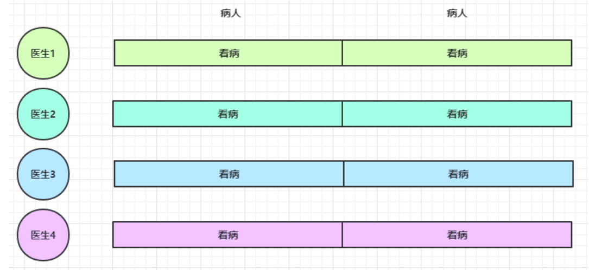


经研究发现，看病可以细分为四个步骤，经拆分后每个步骤需要 5 分钟

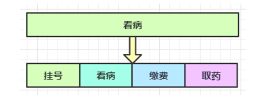


因此可以做如下优化，只有一开始，医生 2、3、4 分别要等待 5、10、15 分钟才能执行工作，但只要后续病人源源不断地来，他们就能够满负荷工作，并且处理病人的能力提高到了 `4 * 8 * 12` 效率几乎是原来的四倍


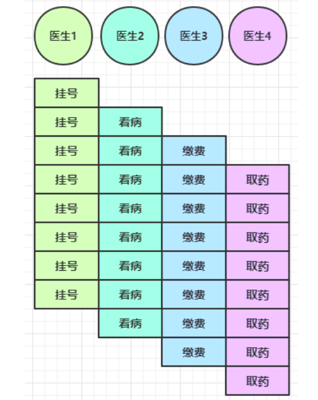


* 单线程没法异步提高效率，必须配合多线程、多核 cpu 才能发挥异步的优势
* 异步并没有缩短响应时间，反而有所增加
* 合理进行任务拆分，也是利用异步的关键


## Future和Promise

在异步处理时，经常用到这两个接口

netty 中的 Future 与 jdk 中的 Future 同名，但是是两个接口，netty 的 Future 继承自 jdk 的 Future，而 Promise 又对 netty Future 进行了扩展

* jdk Future 只能同步等待任务结束（或成功、或失败）才能得到结果
* netty Future 可以同步等待任务结束得到结果，也可以异步方式得到结果，但都是要等任务结束
* netty Promise 不仅有 netty Future 的功能，而且脱离了任务独立存在，只作为两个线程间传递结果的容器


|  功能/名称   |           jdk Future           |                         netty Future                         |   Promise    |
| :----------: | :----------------------------: | :----------------------------------------------------------: | :----------: |
|    cancel    |            取消任务            |                              -                               |      -       |
|  isCanceled  |          任务是否取消          |                              -                               |      -       |
|    isDone    | 任务是否完成，不能区分成功失败 |                              -                               |      -       |
|     get      |     获取任务结果，阻塞等待     |                              -                               |      -       |
|    getNow    |               -                |        获取任务结果，非阻塞，还未产生结果时返回 null         |      -       |
|    await     |               -                | 等待任务结束，如果任务失败，不会抛异常，而是通过 isSuccess 判断 |      -       |
|     sync     |               -                |             等待任务结束，如果任务失败，抛出异常             |      -       |
|  isSuccess   |               -                |                       判断任务是否成功                       |      -       |
|    cause     |               -                |         获取失败信息，非阻塞，如果没有失败，返回null         |      -       |
| addLinstener |               -                |                    添加回调，异步接收结果                    |      -       |
|  setSuccess  |               -                |                              -                               | 设置成功结果 |
|  setFailure  |               -                |                              -                               | 设置失败结果 |


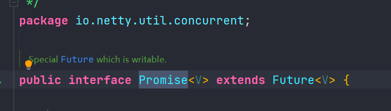


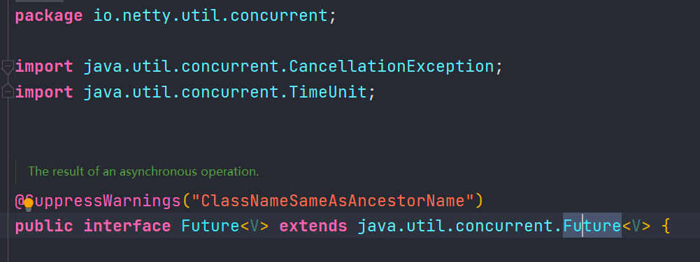


### Future

**同步处理任务**

```java
package mao.t6;

import io.netty.channel.DefaultEventLoopGroup;
import io.netty.util.concurrent.Future;
import lombok.SneakyThrows;
import lombok.extern.slf4j.Slf4j;

import java.util.concurrent.Callable;

/**
 * Project name(项目名称)：Netty_Component
 * Package(包名): mao.t6
 * Class(类名): FutureTest
 * Author(作者）: mao
 * Author QQ：1296193245
 * GitHub：https://github.com/maomao124/
 * Date(创建日期)： 2023/3/19
 * Time(创建时间)： 22:24
 * Version(版本): 1.0
 * Description(描述)： Future测试，同步处理任务
 */

@Slf4j
public class FutureTest
{
    @SneakyThrows
    public static void main(String[] args)
    {
        DefaultEventLoopGroup defaultEventLoopGroup = new DefaultEventLoopGroup(3);
        Future<Integer> future = defaultEventLoopGroup.submit(new Callable<Integer>()
        {
            @Override
            public Integer call() throws Exception
            {
                try
                {
                    Thread.sleep(1000);
                }
                catch (InterruptedException e)
                {
                    e.printStackTrace();
                }
                log.debug("执行成功");
                return 10;
            }
        });

        log.debug(future.toString());
        //现在读取，无法读取
        Integer integer = future.getNow();
        log.debug(String.valueOf(integer));
        log.debug("开始同步等待结果");
        future.sync();
        integer = future.getNow();
        log.debug(integer.toString());
    }
}
```


运行结果：

```sh
2023-03-19  22:33:31.171  [main] DEBUG mao.t6.FutureTest:  PromiseTask@3a7442c7(incomplete, task: mao.t6.FutureTest$1@4be29ed9)
2023-03-19  22:33:31.172  [main] DEBUG mao.t6.FutureTest:  null
2023-03-19  22:33:31.172  [main] DEBUG mao.t6.FutureTest:  开始同步等待结果
2023-03-19  22:33:32.182  [defaultEventLoopGroup-2-1] DEBUG mao.t6.FutureTest:  执行成功
2023-03-19  22:33:32.182  [main] DEBUG mao.t6.FutureTest:  10
```


**异步处理任务**

```java
package mao.t6;

import io.netty.channel.DefaultEventLoopGroup;
import io.netty.util.concurrent.Future;
import io.netty.util.concurrent.GenericFutureListener;
import lombok.extern.slf4j.Slf4j;

import java.util.concurrent.Callable;

/**
 * Project name(项目名称)：Netty_Component
 * Package(包名): mao.t6
 * Class(类名): FutureTest2
 * Author(作者）: mao
 * Author QQ：1296193245
 * GitHub：https://github.com/maomao124/
 * Date(创建日期)： 2023/3/19
 * Time(创建时间)： 22:35
 * Version(版本): 1.0
 * Description(描述)： Future测试，异步处理任务
 */

@Slf4j
public class FutureTest2
{
    public static void main(String[] args)
    {
        DefaultEventLoopGroup defaultEventLoopGroup = new DefaultEventLoopGroup(3);
        Future<Integer> future = defaultEventLoopGroup.submit(new Callable<Integer>()
        {
            @Override
            public Integer call() throws Exception
            {
                try
                {
                    Thread.sleep(1000);
                }
                catch (InterruptedException e)
                {
                    e.printStackTrace();
                }
                log.debug("执行成功");
                return 20;
            }
        });

        log.debug(future.toString());
        //现在读取，无法读取
        Integer integer = future.getNow();
        log.debug(String.valueOf(integer));
        log.debug("开始异步等待结果");
        future.addListener(new GenericFutureListener<Future<? super Integer>>()
        {
            /**
             * 操作完成
             *
             * @param future Future
             * @throws Exception 异常
             */
            @Override
            public void operationComplete(Future<? super Integer> future) throws Exception
            {
                log.debug("等待完成，结果：" + future.get());
            }
        });
    }
}
```


运行结果：

```sh
2023-03-19  22:37:45.795  [main] DEBUG mao.t6.FutureTest2:  PromiseTask@3a7442c7(incomplete, task: mao.t6.FutureTest2$1@4be29ed9)
2023-03-19  22:37:45.796  [main] DEBUG mao.t6.FutureTest2:  null
2023-03-19  22:37:45.796  [main] DEBUG mao.t6.FutureTest2:  开始异步等待结果
2023-03-19  22:37:46.810  [defaultEventLoopGroup-2-1] DEBUG mao.t6.FutureTest2:  执行成功
2023-03-19  22:37:46.811  [defaultEventLoopGroup-2-1] DEBUG mao.t6.FutureTest2:  等待完成，结果：20
```


### Promise

**同步处理任务成功**

```java
package mao.t6;

import io.netty.channel.DefaultEventLoop;
import io.netty.channel.DefaultEventLoopGroup;
import io.netty.util.concurrent.DefaultPromise;
import io.netty.util.concurrent.Promise;
import lombok.SneakyThrows;
import lombok.extern.slf4j.Slf4j;

import java.util.concurrent.Callable;

/**
 * Project name(项目名称)：Netty_Component
 * Package(包名): mao.t6
 * Class(类名): PromiseTest
 * Author(作者）: mao
 * Author QQ：1296193245
 * GitHub：https://github.com/maomao124/
 * Date(创建日期)： 2023/3/19
 * Time(创建时间)： 22:39
 * Version(版本): 1.0
 * Description(描述)： Promise测试 ，同步处理任务成功
 */

@Slf4j
public class PromiseTest
{
    @SneakyThrows
    public static void main(String[] args)
    {
        DefaultEventLoop defaultEventLoop = new DefaultEventLoop();
        Promise<Integer> promise = new DefaultPromise<>(defaultEventLoop);
        defaultEventLoop.execute(new Runnable()
        {
            @Override
            public void run()
            {
                try
                {
                    Thread.sleep(1000);
                }
                catch (Exception e)
                {
                    e.printStackTrace();
                }
                log.debug("执行完成");
                promise.setSuccess(30);
            }
        });

        log.debug(promise.toString());
        log.debug("读取数据：" + promise.getNow());
        log.debug("同步等待结果");
        log.debug("结果：" + promise.get());

    }
}
```


运行结果：

```sh
2023-03-19  22:44:26.183  [main] DEBUG mao.t6.PromiseTest:  DefaultPromise@15bb5034(incomplete)
2023-03-19  22:44:26.183  [main] DEBUG mao.t6.PromiseTest:  读取数据：null
2023-03-19  22:44:26.183  [main] DEBUG mao.t6.PromiseTest:  同步等待结果
2023-03-19  22:44:27.191  [defaultEventLoop-1-1] DEBUG mao.t6.PromiseTest:  执行完成
2023-03-19  22:44:27.192  [main] DEBUG mao.t6.PromiseTest:  结果：30
```


**异步处理任务成功**

```java
package mao.t6;

import io.netty.channel.DefaultEventLoop;
import io.netty.util.concurrent.DefaultPromise;
import io.netty.util.concurrent.Future;
import io.netty.util.concurrent.GenericFutureListener;
import io.netty.util.concurrent.Promise;
import lombok.SneakyThrows;
import lombok.extern.slf4j.Slf4j;

/**
 * Project name(项目名称)：Netty_Component
 * Package(包名): mao.t6
 * Class(类名): PromiseTest2
 * Author(作者）: mao
 * Author QQ：1296193245
 * GitHub：https://github.com/maomao124/
 * Date(创建日期)： 2023/3/19
 * Time(创建时间)： 22:45
 * Version(版本): 1.0
 * Description(描述)： Promise测试 ，异步处理任务成功
 */

@Slf4j
public class PromiseTest2
{
    @SneakyThrows
    public static void main(String[] args)
    {
        DefaultEventLoop defaultEventLoop = new DefaultEventLoop();
        Promise<Integer> promise = new DefaultPromise<>(defaultEventLoop);
        defaultEventLoop.execute(new Runnable()
        {
            @Override
            public void run()
            {
                try
                {
                    Thread.sleep(1000);
                }
                catch (Exception e)
                {
                    e.printStackTrace();
                }
                log.debug("执行完成");
                promise.setSuccess(40);
            }
        });

        log.debug(promise.toString());
        log.debug("读取数据：" + promise.getNow());
        log.debug("同步等待结果");
        promise.addListener(new GenericFutureListener<Future<? super Integer>>()
        {
            @Override
            public void operationComplete(Future<? super Integer> future) throws Exception
            {
                log.debug("结果：" + promise.get());
            }
        });
    }
}
```


运行结果：

```sh
2023-03-19  22:46:58.927  [main] DEBUG mao.t6.PromiseTest2:  DefaultPromise@2eae8e6e(incomplete)
2023-03-19  22:46:58.927  [main] DEBUG mao.t6.PromiseTest2:  读取数据：null
2023-03-19  22:46:58.927  [main] DEBUG mao.t6.PromiseTest2:  同步等待结果
2023-03-19  22:46:59.942  [defaultEventLoop-1-1] DEBUG mao.t6.PromiseTest2:  执行完成
2023-03-19  22:46:59.942  [defaultEventLoop-1-1] DEBUG mao.t6.PromiseTest2:  结果：40
```


**同步处理任务失败 get**

sync() 也会出现异常，只是 get 会再用 ExecutionException 包一层异常

```java
package mao.t6;

import io.netty.channel.DefaultEventLoop;
import io.netty.util.concurrent.DefaultPromise;
import io.netty.util.concurrent.Promise;
import lombok.SneakyThrows;
import lombok.extern.slf4j.Slf4j;

/**
 * Project name(项目名称)：Netty_Component
 * Package(包名): mao.t6
 * Class(类名): PromiseTest3
 * Author(作者）: mao
 * Author QQ：1296193245
 * GitHub：https://github.com/maomao124/
 * Date(创建日期)： 2023/3/19
 * Time(创建时间)： 22:54
 * Version(版本): 1.0
 * Description(描述)： 同步处理任务失败 get
 */

@Slf4j
public class PromiseTest3
{
    @SneakyThrows
    public static void main(String[] args)
    {
        DefaultEventLoop defaultEventLoop = new DefaultEventLoop();
        Promise<Integer> promise = new DefaultPromise<>(defaultEventLoop);
        defaultEventLoop.execute(new Runnable()
        {
            @Override
            public void run()
            {
                try
                {
                    Thread.sleep(1000);
                    throw new RuntimeException("执行错误");
                    //log.debug("执行完成");
                    //promise.setSuccess(30);
                }
                catch (Exception e)
                {
                    log.debug("执行错误");
                    promise.setFailure(e);
                }
            }
        });

        log.debug(promise.toString());
        log.debug("读取数据：" + promise.getNow());
        log.debug("同步等待结果");
        log.debug("结果：" + promise.get());

    }
}

```


运行结果：

```sh
2023-03-19  22:58:02.197  [main] DEBUG mao.t6.PromiseTest3:  DefaultPromise@15bb5034(incomplete)
2023-03-19  22:58:02.198  [main] DEBUG mao.t6.PromiseTest3:  读取数据：null
2023-03-19  22:58:02.198  [main] DEBUG mao.t6.PromiseTest3:  同步等待结果
2023-03-19  22:58:03.203  [defaultEventLoop-1-1] DEBUG mao.t6.PromiseTest3:  执行错误
Exception in thread "main" java.util.concurrent.ExecutionException: java.lang.RuntimeException: 执行错误
	at io.netty.util.concurrent.AbstractFuture.get(AbstractFuture.java:41)
	at mao.t6.PromiseTest3.main(PromiseTest3.java:53)
Caused by: java.lang.RuntimeException: 执行错误
	at mao.t6.PromiseTest3$1.run(PromiseTest3.java:38)
	at io.netty.channel.DefaultEventLoop.run(DefaultEventLoop.java:54)
	at io.netty.util.concurrent.SingleThreadEventExecutor$5.run(SingleThreadEventExecutor.java:918)
	at io.netty.util.internal.ThreadExecutorMap$2.run(ThreadExecutorMap.java:74)
	at io.netty.util.concurrent.FastThreadLocalRunnable.run(FastThreadLocalRunnable.java:30)
	at java.base/java.lang.Thread.run(Thread.java:831)
```


**同步处理任务失败 sync**

```java
package mao.t6;

import io.netty.channel.DefaultEventLoop;
import io.netty.util.concurrent.DefaultPromise;
import io.netty.util.concurrent.Promise;
import lombok.SneakyThrows;
import lombok.extern.slf4j.Slf4j;

/**
 * Project name(项目名称)：Netty_Component
 * Package(包名): mao.t6
 * Class(类名): PromiseTest4
 * Author(作者）: mao
 * Author QQ：1296193245
 * GitHub：https://github.com/maomao124/
 * Date(创建日期)： 2023/3/19
 * Time(创建时间)： 22:59
 * Version(版本): 1.0
 * Description(描述)： 同步处理任务失败 sync
 */

@Slf4j
public class PromiseTest4
{
    @SneakyThrows
    public static void main(String[] args)
    {
        DefaultEventLoop defaultEventLoop = new DefaultEventLoop();
        Promise<Integer> promise = new DefaultPromise<>(defaultEventLoop);
        defaultEventLoop.execute(new Runnable()
        {
            @Override
            public void run()
            {
                try
                {
                    Thread.sleep(1000);
                    throw new RuntimeException("执行错误");
                    //log.debug("执行完成");
                    //promise.setSuccess(30);
                }
                catch (Exception e)
                {
                    log.debug("执行错误");
                    promise.setFailure(e);
                }
            }
        });

        log.debug(promise.toString());
        log.debug("读取数据：" + promise.getNow());
        log.debug("同步等待结果");
        promise.sync();
        log.debug("结果：" + promise.getNow());
    }
}
```


运行结果：

```sh
2023-03-19  23:01:02.550  [main] DEBUG mao.t6.PromiseTest4:  DefaultPromise@15bb5034(incomplete)
2023-03-19  23:01:02.552  [main] DEBUG mao.t6.PromiseTest4:  读取数据：null
2023-03-19  23:01:02.552  [main] DEBUG mao.t6.PromiseTest4:  同步等待结果
2023-03-19  23:01:03.554  [defaultEventLoop-1-1] DEBUG mao.t6.PromiseTest4:  执行错误
2023-03-19  23:01:03.562  [main] DEBUG io.netty.util.internal.PlatformDependent:  Platform: Windows
2023-03-19  23:01:03.564  [main] DEBUG io.netty.util.internal.PlatformDependent0:  -Dio.netty.noUnsafe: false
2023-03-19  23:01:03.565  [main] DEBUG io.netty.util.internal.PlatformDependent0:  Java version: 16
2023-03-19  23:01:03.566  [main] DEBUG io.netty.util.internal.PlatformDependent0:  sun.misc.Unsafe.theUnsafe: available
2023-03-19  23:01:03.566  [main] DEBUG io.netty.util.internal.PlatformDependent0:  sun.misc.Unsafe.copyMemory: available
2023-03-19  23:01:03.567  [main] DEBUG io.netty.util.internal.PlatformDependent0:  java.nio.Buffer.address: available
2023-03-19  23:01:03.568  [main] DEBUG io.netty.util.internal.PlatformDependent0:  direct buffer constructor: unavailable
java.lang.UnsupportedOperationException: Reflective setAccessible(true) disabled
	at io.netty.util.internal.ReflectionUtil.trySetAccessible(ReflectionUtil.java:31) ~[netty-all-4.1.39.Final.jar:4.1.39.Final]
	at io.netty.util.internal.PlatformDependent0$4.run(PlatformDependent0.java:224) ~[netty-all-4.1.39.Final.jar:4.1.39.Final]
	at java.security.AccessController.doPrivileged(AccessController.java:312) ~[?:?]
	at io.netty.util.internal.PlatformDependent0.<clinit>(PlatformDependent0.java:218) [netty-all-4.1.39.Final.jar:4.1.39.Final]
	at io.netty.util.internal.PlatformDependent.isAndroid(PlatformDependent.java:272) [netty-all-4.1.39.Final.jar:4.1.39.Final]
	at io.netty.util.internal.PlatformDependent.<clinit>(PlatformDependent.java:92) [netty-all-4.1.39.Final.jar:4.1.39.Final]
	at io.netty.util.concurrent.DefaultPromise.rethrowIfFailed(DefaultPromise.java:573) [netty-all-4.1.39.Final.jar:4.1.39.Final]
	at io.netty.util.concurrent.DefaultPromise.sync(DefaultPromise.java:327) [netty-all-4.1.39.Final.jar:4.1.39.Final]
	at mao.t6.PromiseTest4.main(PromiseTest4.java:53) [classes/:?]
2023-03-19  23:01:03.587  [main] DEBUG io.netty.util.internal.PlatformDependent0:  java.nio.Bits.unaligned: available, true
2023-03-19  23:01:03.588  [main] DEBUG io.netty.util.internal.PlatformDependent0:  jdk.internal.misc.Unsafe.allocateUninitializedArray(int): unavailable
java.lang.IllegalAccessException: class io.netty.util.internal.PlatformDependent0$6 cannot access class jdk.internal.misc.Unsafe (in module java.base) because module java.base does not export jdk.internal.misc to unnamed module @1188e820
	at jdk.internal.reflect.Reflection.newIllegalAccessException(Reflection.java:385) ~[?:?]
	at java.lang.reflect.AccessibleObject.checkAccess(AccessibleObject.java:687) ~[?:?]
	at java.lang.reflect.Method.invoke(Method.java:559) ~[?:?]
	at io.netty.util.internal.PlatformDependent0$6.run(PlatformDependent0.java:334) ~[netty-all-4.1.39.Final.jar:4.1.39.Final]
	at java.security.AccessController.doPrivileged(AccessController.java:312) ~[?:?]
	at io.netty.util.internal.PlatformDependent0.<clinit>(PlatformDependent0.java:325) [netty-all-4.1.39.Final.jar:4.1.39.Final]
	at io.netty.util.internal.PlatformDependent.isAndroid(PlatformDependent.java:272) [netty-all-4.1.39.Final.jar:4.1.39.Final]
	at io.netty.util.internal.PlatformDependent.<clinit>(PlatformDependent.java:92) [netty-all-4.1.39.Final.jar:4.1.39.Final]
	at io.netty.util.concurrent.DefaultPromise.rethrowIfFailed(DefaultPromise.java:573) [netty-all-4.1.39.Final.jar:4.1.39.Final]
	at io.netty.util.concurrent.DefaultPromise.sync(DefaultPromise.java:327) [netty-all-4.1.39.Final.jar:4.1.39.Final]
	at mao.t6.PromiseTest4.main(PromiseTest4.java:53) [classes/:?]
2023-03-19  23:01:03.589  [main] DEBUG io.netty.util.internal.PlatformDependent0:  java.nio.DirectByteBuffer.<init>(long, int): unavailable
2023-03-19  23:01:03.589  [main] DEBUG io.netty.util.internal.PlatformDependent:  sun.misc.Unsafe: available
2023-03-19  23:01:03.589  [main] DEBUG io.netty.util.internal.PlatformDependent:  maxDirectMemory: 8522825728 bytes (maybe)
2023-03-19  23:01:03.590  [main] DEBUG io.netty.util.internal.PlatformDependent:  -Dio.netty.tmpdir: C:\Users\mao\AppData\Local\Temp (java.io.tmpdir)
2023-03-19  23:01:03.590  [main] DEBUG io.netty.util.internal.PlatformDependent:  -Dio.netty.bitMode: 64 (sun.arch.data.model)
2023-03-19  23:01:03.590  [main] DEBUG io.netty.util.internal.PlatformDependent:  -Dio.netty.maxDirectMemory: -1 bytes
2023-03-19  23:01:03.592  [main] DEBUG io.netty.util.internal.PlatformDependent:  -Dio.netty.uninitializedArrayAllocationThreshold: -1
2023-03-19  23:01:03.592  [main] DEBUG io.netty.util.internal.CleanerJava9:  java.nio.ByteBuffer.cleaner(): available
2023-03-19  23:01:03.593  [main] DEBUG io.netty.util.internal.PlatformDependent:  -Dio.netty.noPreferDirect: false
Exception in thread "main" java.lang.RuntimeException: 执行错误
	at mao.t6.PromiseTest4$1.run(PromiseTest4.java:38)
	at io.netty.channel.DefaultEventLoop.run(DefaultEventLoop.java:54)
	at io.netty.util.concurrent.SingleThreadEventExecutor$5.run(SingleThreadEventExecutor.java:918)
	at io.netty.util.internal.ThreadExecutorMap$2.run(ThreadExecutorMap.java:74)
	at io.netty.util.concurrent.FastThreadLocalRunnable.run(FastThreadLocalRunnable.java:30)
	at java.base/java.lang.Thread.run(Thread.java:831)
```


**同步处理任务失败 await**

与 sync 和 get 区别在于，不会抛异常

```java
package mao.t6;

import io.netty.channel.DefaultEventLoop;
import io.netty.util.concurrent.DefaultPromise;
import io.netty.util.concurrent.Promise;
import lombok.SneakyThrows;
import lombok.extern.slf4j.Slf4j;

/**
 * Project name(项目名称)：Netty_Component
 * Package(包名): mao.t6
 * Class(类名): PromiseTest5
 * Author(作者）: mao
 * Author QQ：1296193245
 * GitHub：https://github.com/maomao124/
 * Date(创建日期)： 2023/3/19
 * Time(创建时间)： 23:03
 * Version(版本): 1.0
 * Description(描述)： 同步处理任务失败 await
 */

@Slf4j
public class PromiseTest5
{
    @SneakyThrows
    public static void main(String[] args)
    {
        DefaultEventLoop defaultEventLoop = new DefaultEventLoop();
        Promise<Integer> promise = new DefaultPromise<>(defaultEventLoop);
        defaultEventLoop.execute(new Runnable()
        {
            @Override
            public void run()
            {
                try
                {
                    Thread.sleep(1000);

                    if (System.currentTimeMillis() % 2 == 0)
                    {
                        throw new RuntimeException("执行错误");
                    }
                    log.debug("执行完成");
                    promise.setSuccess(100);
                }
                catch (Exception e)
                {
                    log.debug("执行错误");
                    promise.setFailure(e);
                }
            }
        });

        log.debug(promise.toString());
        log.debug("读取数据：" + promise.getNow());
        log.debug("同步等待结果");
        promise.await();
        boolean success = promise.isSuccess();
        if (success)
        {
            log.debug("结果：" + promise.getNow());
        }
        else
        {
            Throwable throwable = promise.cause();
            log.warn("处理失败", throwable);
        }

    }
}
```


运行结果：

```sh
2023-03-19  23:08:47.960  [main] DEBUG mao.t6.PromiseTest5:  DefaultPromise@15bb5034(incomplete)
2023-03-19  23:08:47.962  [main] DEBUG mao.t6.PromiseTest5:  读取数据：null
2023-03-19  23:08:47.962  [main] DEBUG mao.t6.PromiseTest5:  同步等待结果
2023-03-19  23:08:48.967  [defaultEventLoop-1-1] DEBUG mao.t6.PromiseTest5:  执行完成
2023-03-19  23:08:48.969  [main] DEBUG mao.t6.PromiseTest5:  结果：30
```

```sh
2023-03-19  23:09:25.030  [main] DEBUG mao.t6.PromiseTest5:  DefaultPromise@15bb5034(incomplete)
2023-03-19  23:09:25.032  [main] DEBUG mao.t6.PromiseTest5:  读取数据：null
2023-03-19  23:09:25.032  [main] DEBUG mao.t6.PromiseTest5:  同步等待结果
2023-03-19  23:09:26.044  [defaultEventLoop-1-1] DEBUG mao.t6.PromiseTest5:  执行错误
2023-03-19  23:09:26.045  [main] WARN  mao.t6.PromiseTest5:  处理失败
java.lang.RuntimeException: 执行错误
	at mao.t6.PromiseTest5$1.run(PromiseTest5.java:41) ~[classes/:?]
	at io.netty.channel.DefaultEventLoop.run(DefaultEventLoop.java:54) ~[netty-all-4.1.39.Final.jar:4.1.39.Final]
	at io.netty.util.concurrent.SingleThreadEventExecutor$5.run(SingleThreadEventExecutor.java:918) ~[netty-all-4.1.39.Final.jar:4.1.39.Final]
	at io.netty.util.internal.ThreadExecutorMap$2.run(ThreadExecutorMap.java:74) ~[netty-all-4.1.39.Final.jar:4.1.39.Final]
	at io.netty.util.concurrent.FastThreadLocalRunnable.run(FastThreadLocalRunnable.java:30) ~[netty-all-4.1.39.Final.jar:4.1.39.Final]
	at java.lang.Thread.run(Thread.java:831) ~[?:?]
```


**异步处理任务失败**

```java
package mao.t6;

import io.netty.channel.DefaultEventLoop;
import io.netty.util.concurrent.DefaultPromise;
import io.netty.util.concurrent.Future;
import io.netty.util.concurrent.GenericFutureListener;
import io.netty.util.concurrent.Promise;
import lombok.SneakyThrows;
import lombok.extern.slf4j.Slf4j;

/**
 * Project name(项目名称)：Netty_Component
 * Package(包名): mao.t6
 * Class(类名): PromiseTest6
 * Author(作者）: mao
 * Author QQ：1296193245
 * GitHub：https://github.com/maomao124/
 * Date(创建日期)： 2023/3/19
 * Time(创建时间)： 23:10
 * Version(版本): 1.0
 * Description(描述)： 异步处理任务失败
 */

@Slf4j
public class PromiseTest6
{
    @SneakyThrows
    public static void main(String[] args)
    {
        DefaultEventLoop defaultEventLoop = new DefaultEventLoop();
        Promise<Integer> promise = new DefaultPromise<>(defaultEventLoop);
        defaultEventLoop.execute(new Runnable()
        {
            @Override
            public void run()
            {
                try
                {
                    Thread.sleep(1000);

                    if (System.currentTimeMillis() % 2 == 0)
                    {
                        throw new RuntimeException("执行错误");
                    }
                    log.debug("执行完成");
                    promise.setSuccess(110);
                }
                catch (Exception e)
                {
                    log.debug("执行错误");
                    promise.setFailure(e);
                }
            }
        });

        log.debug(promise.toString());
        log.debug("读取数据：" + promise.getNow());
        log.debug("异步等待结果");
        promise.addListener(new GenericFutureListener<Future<? super Integer>>()
        {
            @Override
            public void operationComplete(Future<? super Integer> future) throws Exception
            {
                boolean success = promise.isSuccess();
                if (success)
                {
                    log.debug("结果：" + promise.getNow());
                }
                else
                {
                    Throwable throwable = promise.cause();
                    log.warn("处理失败", throwable);
                }
            }
        });

    }
}
```


运行结果：

```sh
2023-03-19  23:13:01.522  [main] DEBUG mao.t6.PromiseTest6:  DefaultPromise@2eae8e6e(incomplete)
2023-03-19  23:13:01.522  [main] DEBUG mao.t6.PromiseTest6:  读取数据：null
2023-03-19  23:13:01.522  [main] DEBUG mao.t6.PromiseTest6:  异步等待结果
2023-03-19  23:13:02.523  [defaultEventLoop-1-1] DEBUG mao.t6.PromiseTest6:  执行完成
2023-03-19  23:13:02.523  [defaultEventLoop-1-1] DEBUG mao.t6.PromiseTest6:  结果：110
```

```sh
2023-03-19  23:13:19.069  [main] DEBUG mao.t6.PromiseTest6:  DefaultPromise@2eae8e6e(incomplete)
2023-03-19  23:13:19.069  [main] DEBUG mao.t6.PromiseTest6:  读取数据：null
2023-03-19  23:13:19.069  [main] DEBUG mao.t6.PromiseTest6:  异步等待结果
2023-03-19  23:13:20.084  [defaultEventLoop-1-1] DEBUG mao.t6.PromiseTest6:  执行错误
2023-03-19  23:13:20.085  [defaultEventLoop-1-1] WARN  mao.t6.PromiseTest6:  处理失败
java.lang.RuntimeException: 执行错误
	at mao.t6.PromiseTest6$1.run(PromiseTest6.java:43) [classes/:?]
	at io.netty.channel.DefaultEventLoop.run(DefaultEventLoop.java:54) [netty-all-4.1.39.Final.jar:4.1.39.Final]
	at io.netty.util.concurrent.SingleThreadEventExecutor$5.run(SingleThreadEventExecutor.java:918) [netty-all-4.1.39.Final.jar:4.1.39.Final]
	at io.netty.util.internal.ThreadExecutorMap$2.run(ThreadExecutorMap.java:74) [netty-all-4.1.39.Final.jar:4.1.39.Final]
	at io.netty.util.concurrent.FastThreadLocalRunnable.run(FastThreadLocalRunnable.java:30) [netty-all-4.1.39.Final.jar:4.1.39.Final]
	at java.lang.Thread.run(Thread.java:831) [?:?]
```


## Handler和Pipeline

ChannelHandler 用来处理 Channel 上的各种事件，分为入站、出站两种。所有 ChannelHandler 被连成一串，就是 Pipeline

* 入站处理器通常是 ChannelInboundHandlerAdapter 的子类，主要用来读取客户端数据，写回结果
* 出站处理器通常是 ChannelOutboundHandlerAdapter 的子类，主要对写回结果进行加工


每个 Channel 是一个产品的加工车间，Pipeline 是车间中的流水线，ChannelHandler 就是流水线上的各道工序，而后面要讲的 ByteBuf 是原材料，经过很多工序的加工：先经过一道道入站工序，再经过一道道出站工序最终变成产品


```java
package mao.t7;

import io.netty.bootstrap.ServerBootstrap;
import io.netty.channel.*;
import io.netty.channel.nio.NioEventLoopGroup;
import io.netty.channel.socket.nio.NioServerSocketChannel;
import io.netty.channel.socket.nio.NioSocketChannel;
import lombok.extern.slf4j.Slf4j;

/**
 * Project name(项目名称)：Netty_Component
 * Package(包名): mao.t7
 * Class(类名): HandlerTest
 * Author(作者）: mao
 * Author QQ：1296193245
 * GitHub：https://github.com/maomao124/
 * Date(创建日期)： 2023/3/20
 * Time(创建时间)： 19:45
 * Version(版本): 1.0
 * Description(描述)： Handler
 */

@Slf4j
public class HandlerTest
{
    public static void main(String[] args)
    {
        new ServerBootstrap()
                .group(new NioEventLoopGroup(), new NioEventLoopGroup(3))
                .channel(NioServerSocketChannel.class)
                .childHandler(new ChannelInitializer<NioSocketChannel>()
                {
                    @Override
                    protected void initChannel(NioSocketChannel ch) throws Exception
                    {
                        ch.pipeline().addLast(new ChannelInboundHandlerAdapter()
                                {
                                    @Override
                                    public void channelRead(ChannelHandlerContext ctx, Object msg) throws Exception
                                    {
                                        log.debug("入栈处理器：1");
                                        super.channelRead(ctx, msg);
                                    }
                                })
                                .addLast(new ChannelInboundHandlerAdapter()
                                {
                                    @Override
                                    public void channelRead(ChannelHandlerContext ctx, Object msg) throws Exception
                                    {
                                        log.debug("入栈处理器：2");
                                        super.channelRead(ctx, msg);
                                    }
                                })
                                .addLast(new ChannelInboundHandlerAdapter()
                                {
                                    @Override
                                    public void channelRead(ChannelHandlerContext ctx, Object msg) throws Exception
                                    {
                                        log.debug("入栈处理器：3");
                                        super.channelRead(ctx, msg);
                                    }
                                })
                                .addLast(new ChannelInboundHandlerAdapter()
                                {
                                    @Override
                                    public void channelRead(ChannelHandlerContext ctx, Object msg) throws Exception
                                    {
                                        log.debug("入栈处理器：4");
                                        ctx.channel().write("hello");
                                    }
                                })
                                .addLast(new ChannelOutboundHandlerAdapter()
                                {
                                    @Override
                                    public void write(ChannelHandlerContext ctx, Object msg, ChannelPromise promise)
                                            throws Exception
                                    {
                                        log.debug("出栈处理器：5");
                                        super.write(ctx, msg, promise);
                                    }
                                })
                                .addLast(new ChannelOutboundHandlerAdapter()
                                {
                                    @Override
                                    public void write(ChannelHandlerContext ctx, Object msg, ChannelPromise promise)
                                            throws Exception
                                    {
                                        log.debug("出栈处理器：6");
                                        super.write(ctx, msg, promise);
                                    }
                                })
                                .addLast(new ChannelOutboundHandlerAdapter()
                                {
                                    @Override
                                    public void write(ChannelHandlerContext ctx, Object msg, ChannelPromise promise)
                                            throws Exception
                                    {
                                        log.debug("出栈处理器：7");
                                        super.write(ctx, msg, promise);
                                    }
                                })
                                .addLast(new ChannelOutboundHandlerAdapter()
                                {
                                    @Override
                                    public void write(ChannelHandlerContext ctx, Object msg, ChannelPromise promise)
                                            throws Exception
                                    {
                                        log.debug("出栈处理器：8");
                                        super.write(ctx, msg, promise);
                                    }
                                });
                    }
                })
                .bind(8080);
    }
}
```


客户端

```java
package mao.t7;

import io.netty.bootstrap.Bootstrap;
import io.netty.channel.Channel;
import io.netty.channel.ChannelInitializer;
import io.netty.channel.nio.NioEventLoopGroup;
import io.netty.channel.socket.nio.NioSocketChannel;
import io.netty.handler.codec.string.StringEncoder;
import io.netty.util.concurrent.Future;
import io.netty.util.concurrent.GenericFutureListener;
import lombok.SneakyThrows;
import lombok.extern.slf4j.Slf4j;

import java.net.InetSocketAddress;

/**
 * Project name(项目名称)：Netty_Component
 * Package(包名): mao.t7
 * Class(类名): Client
 * Author(作者）: mao
 * Author QQ：1296193245
 * GitHub：https://github.com/maomao124/
 * Date(创建日期)： 2023/3/20
 * Time(创建时间)： 20:50
 * Version(版本): 1.0
 * Description(描述)： 无
 */

@Slf4j
public class Client
{
    @SneakyThrows
    public static void main(String[] args)
    {
        Channel channel = new Bootstrap()
                .group(new NioEventLoopGroup())
                .channel(NioSocketChannel.class)
                .handler(new ChannelInitializer<Channel>()
                {
                    @Override
                    protected void initChannel(Channel ch) throws Exception
                    {
                        ch.pipeline().addLast(new StringEncoder());
                    }
                })
                .connect(new InetSocketAddress(8080)).sync().channel();
        channel.writeAndFlush("hello");
    }
}
```


运行结果：

```sh
2023-03-20  21:02:01.307  [nioEventLoopGroup-3-1] DEBUG mao.t7.HandlerTest:  入栈处理器：1
2023-03-20  21:02:01.307  [nioEventLoopGroup-3-1] DEBUG mao.t7.HandlerTest:  入栈处理器：2
2023-03-20  21:02:01.307  [nioEventLoopGroup-3-1] DEBUG mao.t7.HandlerTest:  入栈处理器：3
2023-03-20  21:02:01.307  [nioEventLoopGroup-3-1] DEBUG mao.t7.HandlerTest:  入栈处理器：4
2023-03-20  21:02:01.307  [nioEventLoopGroup-3-1] DEBUG mao.t7.HandlerTest:  出栈处理器：8
2023-03-20  21:02:01.307  [nioEventLoopGroup-3-1] DEBUG mao.t7.HandlerTest:  出栈处理器：7
2023-03-20  21:02:01.307  [nioEventLoopGroup-3-1] DEBUG mao.t7.HandlerTest:  出栈处理器：6
2023-03-20  21:02:01.307  [nioEventLoopGroup-3-1] DEBUG mao.t7.HandlerTest:  出栈处理器：5
```


可以看到，ChannelInboundHandlerAdapter 是按照 addLast 的顺序执行的，而 ChannelOutboundHandlerAdapter 是按照 addLast 的逆序执行的。ChannelPipeline 的实现是一个 ChannelHandlerContext（包装了 ChannelHandler） 组成的双向链表


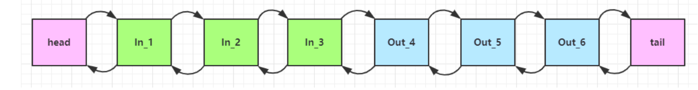


如果注释掉处理器1的super.channelRead(ctx, msg)代码

```java
@Override
public void channelRead(ChannelHandlerContext ctx, Object msg) throws Exception
{
    log.debug("入栈处理器：1");
    //super.channelRead(ctx, msg);
}
```


那么只会打印1

```sh
2023-03-20  21:04:37.663  [nioEventLoopGroup-3-1] DEBUG mao.t7.HandlerTest:  入栈处理器：1
```


如果只注释掉处理器3的super.channelRead(ctx, msg)代码

```java
@Override
public void channelRead(ChannelHandlerContext ctx, Object msg) throws Exception
{
    log.debug("入栈处理器：3");
    //super.channelRead(ctx, msg);
}
```


那么会打印1、2和3

```sh
2023-03-20  21:05:28.347  [nioEventLoopGroup-3-1] DEBUG mao.t7.HandlerTest:  入栈处理器：1
2023-03-20  21:05:28.348  [nioEventLoopGroup-3-1] DEBUG mao.t7.HandlerTest:  入栈处理器：2
2023-03-20  21:05:28.348  [nioEventLoopGroup-3-1] DEBUG mao.t7.HandlerTest:  入栈处理器：3
```


处理器4的ctx.channel().write(msg) 会 **从尾部开始触发** 后续出站处理器的执行


如果注释掉处理器6的super.write(ctx, msg, promise)代码

```java
@Override
public void write(ChannelHandlerContext ctx, Object msg, ChannelPromise promise)
        throws Exception
{
    log.debug("出栈处理器：6");
    //super.write(ctx, msg, promise);
}
```


不会打印5

```sh
2023-03-20  21:08:11.394  [nioEventLoopGroup-3-1] DEBUG mao.t7.HandlerTest:  入栈处理器：1
2023-03-20  21:08:11.394  [nioEventLoopGroup-3-1] DEBUG mao.t7.HandlerTest:  入栈处理器：2
2023-03-20  21:08:11.394  [nioEventLoopGroup-3-1] DEBUG mao.t7.HandlerTest:  入栈处理器：3
2023-03-20  21:08:11.395  [nioEventLoopGroup-3-1] DEBUG mao.t7.HandlerTest:  入栈处理器：4
2023-03-20  21:08:11.395  [nioEventLoopGroup-3-1] DEBUG mao.t7.HandlerTest:  出栈处理器：8
2023-03-20  21:08:11.395  [nioEventLoopGroup-3-1] DEBUG mao.t7.HandlerTest:  出栈处理器：7
2023-03-20  21:08:11.395  [nioEventLoopGroup-3-1] DEBUG mao.t7.HandlerTest:  出栈处理器：6
```


如果处理器4更改成以下代码

```java
@Override
public void channelRead(ChannelHandlerContext ctx, Object msg) throws Exception
{
    log.debug("入栈处理器：4");
    //ctx.channel().write("hello");
    ctx.write("hello");
}
```


```sh
2023-03-20  21:10:35.279  [nioEventLoopGroup-3-1] DEBUG mao.t7.HandlerTest:  入栈处理器：1
2023-03-20  21:10:35.279  [nioEventLoopGroup-3-1] DEBUG mao.t7.HandlerTest:  入栈处理器：2
2023-03-20  21:10:35.279  [nioEventLoopGroup-3-1] DEBUG mao.t7.HandlerTest:  入栈处理器：3
2023-03-20  21:10:35.280  [nioEventLoopGroup-3-1] DEBUG mao.t7.HandlerTest:  入栈处理器：4
```


原因：4 处的 ctx.channel().write(msg) 如果改为 ctx.write(msg) 仅会打印 1 2 3  4，因为节点4之前没有其它出站处理器了


**ctx.channel().write(msg) 和 ctx.write(msg) 的区别**

* 都是触发出站处理器的执行
* ctx.channel().write(msg) 从尾部开始查找出站处理器
* ctx.write(msg) 是从当前节点找上一个出站处理器


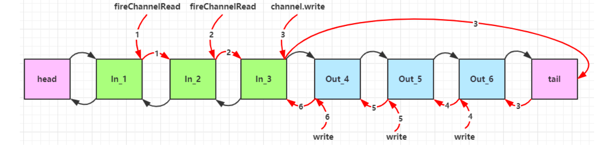


